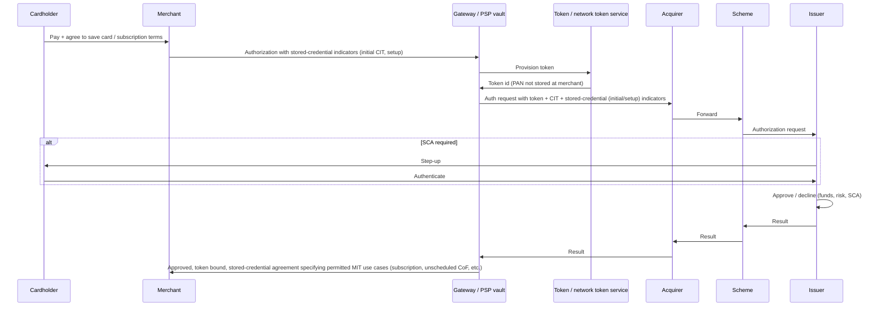
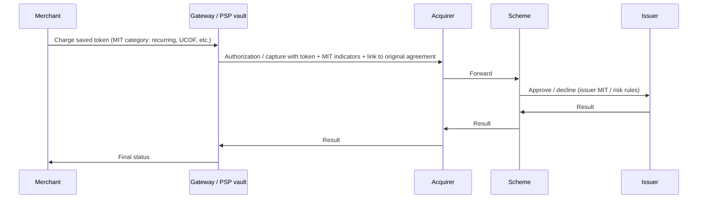

## Introduction

Payment methods do not behave the same way. The split between cards and local payment methods (**LPMs**) is the obvious one, but each category hides its own variations.

This creates real friction on both sides. **Merchants** want to accept payments reliably. **Shoppers** want to pay with their preferred method. Both sides end up navigating inconsistent interactions, edge cases, and operational trade-offs they should not need to know about to complete a simple transaction.

This blog series focuses on **merchant-facing APIs** and treats **capabilities** in **functional** terms: only what crosses the integration boundary matters — inputs, responses, observable state, and end-to-end behavior — with the payment path modeled as a **black box**.

## Ecosystem and Lifecycle

Card payments are a useful reference because the roles are well defined and the same lifecycle vocabulary appears across many integrations. The ecosystem is not just "shopper and merchant"; several specialized parties cooperate, each with a narrow responsibility.

**Typical parties in a card transaction**

- **Cardholder**: The person whose card is used; proves identity and consent (3-D Secure, CVV, PIN where applicable) and holds the account at the **issuer**.
- **Merchant**: Sells goods or services and initiates payment requests toward its **acquirer** (directly or through a **gateway / PSP**).
- **Acquirer** (merchant bank): Underwrites the merchant, routes authorization and capture messages, and participates in **net interbank settlement**. After that, the acquirer credits the merchant (minus fees). 
- **Scheme** (Card network): Visa, Mastercard, and others. Sets rules, routes messages between acquirer and issuer, and operates clearing and often parts of dispute handling. Networks do not hold the cardholder's money; they coordinate messaging and settlement between banks.
- **Issuer** (cardholder bank): Issues the card, approves or declines authorization based on risk and available funds, posts charges to the cardholder, and participates in clearing, settlement, and disputes on the cardholder side.
- **Gateway / PSP** (optional but common): A **gateway** is primarily the technical integration layer — API surface, request orchestration, tokenization, and routing to one or more acquirers. A **PSP** usually includes that gateway layer plus broader commercial and operational scope: merchant onboarding support, risk/fraud operations, reconciliation/reporting tooling, and sometimes settlement or payout services. From the merchant's perspective, this layer is often the primary integration surface even though settlement still runs through acquirer-network-issuer rails. In this series, we use gateway and PSP interchangeably for readability, unless a section needs the distinction explicitly.

With the parties in place, the same transaction flows through a sequence of well-defined phases. The sections below walk through each one in order.

### Onboarding
The merchant (optionally via PSP) onboards with an acquirer: KYC, pricing, MCC, and technical connectivity. The acquirer underwrites the merchant against **scheme rules**: PCI (Payment Card Industry Data Security Standard), branding, permitted category use, and cardholder-data handling. In the usual path the **acquirer** validates and approves the application (a **PSP** may handle operations in front of the acquirer). Direct scheme approval is the exception: some programs, high-risk categories, or network registration require the acquirer to file with the scheme, which then accepts or declines. **The cardholder is not involved in standard onboarding**; onboarding primarily establishes what the merchant may initiate later at checkout.

### Authorization

Payment initiation is the merchant asking the issuer to **authorize** the transaction: assemble amount, currency, merchant identifiers, and card details, and send the **authorization request** through the gateway and acquirer toward the issuer. During that request, the issuer may need to **authenticate** the cardholder first (strong customer authentication / SCA — e.g. 3-D Secure flows, in-app banking approval, OTP, biometrics, or hardware-token factors) before approving. The outcome is typically structured data (e.g. CAVV, ECI) the issuer uses with funds and risk checks to **approve or decline** the transaction.

**Single-Message System (SMS)** and **Dual-Message System (DMS)** describe how the rail packages that decision against clearing. **DMS** separates **authorization** and **capture** (*two-step* / auth+capture): an approval places an **authorization hold**, which confirms availability and (when SCA ran) payer intent but does not pay the merchant; funding follows **capture** and **settlement**. **SMS** combines authorization and capture in one step (`sale` / `purchase`), so there is usually no separate capture operation on the merchant API. **This series defaults to the DMS mental model** unless a later post says otherwise.

### Capture
The merchant (or automated rules) sends **capture** instructions for all or part of the authorized amount. The acquirer presents those transactions into **clearing**: the scheme exchanges clearing records with the issuer so the charge can be posted to the cardholder. Capture is about what is owed and **moving the transaction into clearing**; it is still distinct from **settlement**, where money actually moves between banks.

### Cancel
If the merchant will not capture — order canceled, inventory unavailable, or duplicate auth — they issue **Cancel** while the authorization is still valid. The acquirer asks the issuer to **release the hold**; no capture means no clearing/settlement for that authorization. The wire-level message names, reversal vs void semantics, and same-day timing rules are **processor- and network-specific**.

### Refund
Refunds return money to the cardholder after a successful capture. Operationally, the merchant submits a refund against an existing cleared payment (full or partial), the acquirer validates amount and eligibility, and then sends a credit message through the scheme to the issuer. The issuer posts the credit to the cardholder statement, usually asynchronously from the API response, so merchant systems must track both acceptance and final posting; timing, cutoff behavior, and posting speed remain network- and issuer-dependent.

### Settlement
After clearing, **interbank settlement** moves net obligations between issuer and acquirer according to scheme arrangements. Separately, the **acquirer settles to the merchant**: payout timing (typically T+1 to T+30 business days depending on acquirer, merchant risk profile, and jurisdiction), reserves, and fees are defined in the merchant's contract. Keep these as two distinct layers: scheme-level interbank clearing/settlement vs merchant-facing acquirer payout. The scheme orchestrates the former; it does not replace the latter.

### Dispute
Unlike refunds, **disputes** start from the cardholder side: the **cardholder** challenges the charge with the **issuer**, which opens a **chargeback** (or similar) case. The acquirer and merchant then follow a scheme-defined evidence process with fixed timelines: typical response windows are **7–21 calendar days** from notification, with strict representment deadlines that merchants must track.

### Tokenization
The lifecycle above focuses on a **one-off** payment path. This section extends that model to **stored-instrument** journeys, where a payment credential is saved first and then referenced in later transactions. This extension is easiest to read as **two connected phases**: 

1. **Token creation**: in a **shopper-present** checkout, the payment credential is tokenized and saved for later reuse.
2. **Subsequent charge**: later authorizations reference that saved token, often as **shopper-not-present** transactions.

#### Phase 1: Token Creation

Phase 1 is a **customer-initiated transaction (CIT)**. **SCA**, agreement to save the card or to **MIT** use, and token provisioning often share one checkout, but they are different controls: the cardholder supplies card details, and the **gateway / PSP** drives tokenization and the first authorization with the correct **stored credential** indicators.

Tokenization operates at multiple levels. **PSP vault** tokens are merchant-specific: they live in the PSP's vault and substitute for the PAN only within that PSP integration. **Network** tokens come from scheme programs (**Visa Token Service**, **Mastercard Digital Enablement Service (MDES)**): the networks issue a surrogate that replaces the PAN across participating merchants on that scheme, which reduces fraud exposure because the PAN does not need to touch merchant systems. Some **issuers** also provide token services for their mobile banking apps, enabling payment inside the issuer's own ecosystem before traffic reaches the merchant channel.

In that same flow, the shopper accepts terms to save the card and completes **SCA** when required.

#### Phase 2: Subsequent Charge

Phase 2 means **reusing the saved token** for a later charge, without collecting raw payment details again. The same tokenized pattern can be either **MIT** or **CIT**, depending on who initiates the transaction. If your backend triggers the charge while the cardholder is **not in session** (for example, subscription renewal or **unscheduled** top-up), it is a **merchant-initiated transaction (MIT)**. If the cardholder is present and explicitly confirms “pay with saved card,” it is a **customer-initiated transaction (CIT)** using the same saved token. In both cases, acquirer/scheme routing resolves the token to the underlying card for issuer decision.

##### MIT Classification

These **business patterns** describe how **Phase 2** legs are labeled for schemes; they mostly apply when the merchant **initiates** the charge:

| Term | Meaning |
|------|--------|
| **Card on file (CoF)** | Umbrella: the card is **stored** (as a token) for later use. Does not by itself mean subscription. |
| **Subscription** | **Scheduled** charges (e.g. monthly fee): MIT with a **recurring** indicator; amount may be fixed or variable per your agreement. |
| **Unscheduled COF (UCOF)** | Industry label for **merchant-initiated** charges **without** a fixed schedule — e.g. metered use, top-ups, “charge when balance low.” Still requires valid prior **CIT** agreement from Phase 1. |

## Local Payment Methods

For local payment methods (LPMs), the **ecosystem and lifecycle are largely the same** as cards: similar participants and the same high-level phases — initiate, confirm, collect funds, reconcile, and handle refunds and problems. The **differences are in the details**: who plays each role, how authorization is triggered, and how refunds and disputes work.

### Ecosystem and Lifecycle at a Glance

At a high level, LPMs replace cards' **single global scheme layer** with **national or regional operators** — e.g. PIX, UPI, SEPA, iDEAL, BLIK, Swish, Bizum, FPS, PayNow, PromptPay — each with its own rules, settlement, and dispute framework. Many of these operators function as **local scheme analogs**, while some flows are more directly **bank-led**, **wallet- or platform-led**, or **bilateral**. As a result, you cannot assume one global rulebook the way you can with Visa or Mastercard, and the issuer/acquirer duality often collapses into a single bank role.

The lifecycle shape shifts accordingly: **authorization is frequently push-based** (shopper-pushed from their bank or app) rather than pull-based, and **refund/dispute frameworks are usually less standardized** than the card chargeback system. **Stored-instrument** flows also look different: many rails expose local tokens, aliases, virtual accounts, wallet handles, or mandate references, but there is no single global equivalent to a card PAN-token model. **Phase 2** (reusing a saved instrument) exists where the rail supports standing mandates, wallet authorization reuse, or billing agreements for repeat or merchant-initiated collection, and behavior remains **method- and country-specific** rather than one universal stored-credential framework.

### Summary of Differences

The table below consolidates the card baseline and typical LPM behavior across the aspects touched on above:

| Aspect | Card ecosystem | Typical local / APM behavior |
|--------|----------------|------------------------------|
| **Who "owns" the user account** | Issuer holds the card account; network rules standardize messaging. | Often a bank, wallet, or local operator; rarely a separate “scheme” you integrate against directly. |
| **Authorization path** | Real-time approve/decline on a shared rail (network + issuer). | May be synchronous, or **pending** until the shopper completes a bank login, transfer, QR scan, or store payment. |
| **Credential** | PAN + expiry (often tokenized); strong customer authentication when required. | Bank redirect, IBAN, mobile number, voucher code, QR — method-specific. |
| **Authentication** | 3-D Secure (SCA), optional step-up, exemptions (TRA, low-value, allowlist). | Method-specific: bank login, OTP, QR scan, biometric — often built into the payment flow itself. |
| **Settlement and clearing** | Highly standardized batch clearing between banks via the network. | May be instant push, batched bank transfer, or cash-agent settlement; reconciliation fields differ. |
| **Refunds and disputes** | Chargeback framework is mature and standardized; evidence windows are strict (typically 7–21 days). | Refund support ranges from full to limited or manual; "dispute" may be a support ticket rather than a scheme chargeback, with no fixed evidence window. |
| **Merchant integration** | One mental model (auth/capture/refund) maps across many regions if the PSP abstracts schemes. | More one-off behaviors: expiry of payment codes, offline confirmation, different webhook semantics. |
| **Saved “token” / instrument id** | **Network** or **PSP token** mapping to PAN. | **Vault payment-method id**, mandate reference, wallet handle — **not** a card PAN token. |

Cards are not universally "better"; they are a **shared rail with predictable roles**. LPMs trade that uniformity for **local reach, lower cost in some markets, or shopper preference** — at the cost of more asynchronous states and method-specific operational playbooks. The next section defines **The Five-Lens Framework**: **functions** as the integration units, the **five lenses** as **evaluation dimensions** for comparing how PSP APIs expose them, and shared vocabulary for cross-method comparison.

## The Five-Lens Framework

The **Ecosystem and Lifecycle** section orients you in time and roles — **who** acts and **how** work moves from onboarding through disputes — but it does not tell you **what** to build. **Payment capabilities** are that **what**: merchant-facing **functions** whose operations and signals make each phase executable, recoverable, and observable without guesswork or manual follow-up. Later posts use those **functions** as their organizing keys.

To compare PSP APIs without flattening rail-specific detail, hold the same five **evaluation dimensions** — the **five lenses** in the list below — fixed for each **function**. They are not a rival taxonomy to **functions**; they are the checklist you reuse when the **function** is given and what changes across rails is usually **how it behaves** under each **lens** for retries, asynchronous flows, deadline pressure, and failure.

### The Five Lenses

- **Semantics**: what the function does and does not do. The input/output contract, and the single question it answers.
- **State model**: the statuses the function produces or transitions through, and the allowed transitions between them. Which states are terminal, which are asynchronous, and where the next step lives.
- **Recovery**: how to **stay correct** under retries, timeouts, partial failures, duplicate webhooks, and out-of-order events. Idempotency anchors, reconciliation primitives, and safe fallbacks.
- **Time discipline**: the clocks and windows that govern the function: review SLAs, expirations, capture windows, representment deadlines, settlement lags.
- **Observability**: how the merchant learns the current state and the history behind it: synchronous responses, status queries, webhooks, reports, and reconciliation files.

## Closing

This chapter establishes **ecosystem and lifecycle** vocabulary — who participates and how work moves from onboarding through disputes — and frames **payment capabilities** as merchant-facing **functions** assessed along the **five evaluation dimensions** (the **five lenses**).

The posts that follow move **phase by phase** through the lifecycle. Each post applies the **five lenses** to the **functions** that matter in that phase — comparing PSP API surfaces without flattening rail-specific detail.
