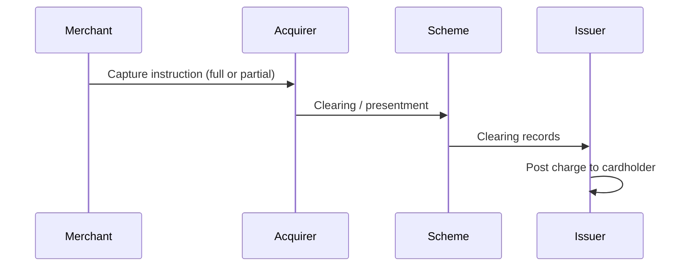
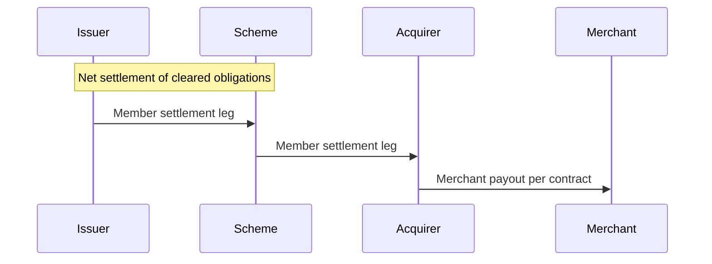
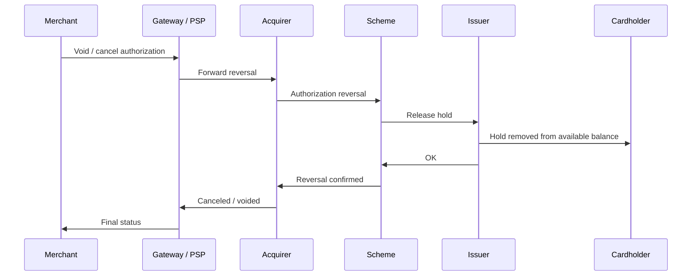
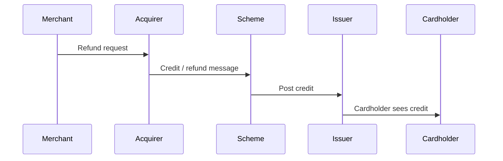
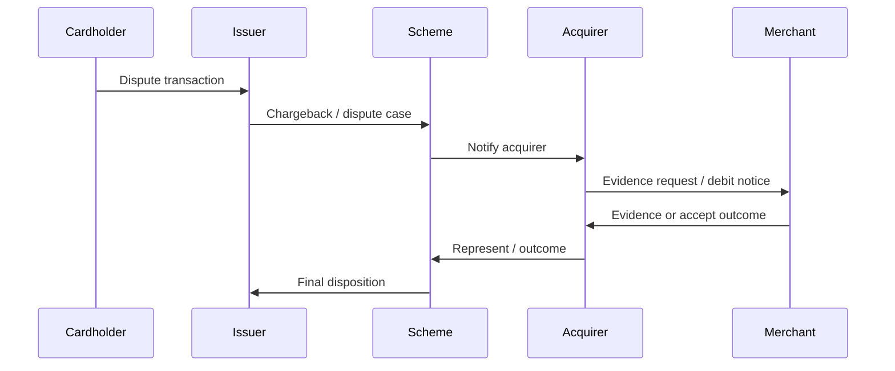

## Introduction

Not every payment method behaves the same way. The difference between cards and local payment methods is usually obvious, but there are also important nuances within each category.

For both merchants and shoppers, this creates real friction. Merchants want to accept payments reliably, and shoppers want to pay with their preferred method, but both sides are often forced to navigate inconsistent capabilities, edge cases, and operational trade-offs. They should not have to become payments experts just to complete a simple transaction.

In this blog, we outline the key capabilities offered by different payment methods and discuss the practical advantages and disadvantages for both merchants and shoppers.

We focus on merchant-facing APIs and describe capabilities from a functional perspective. We do not go deep into implementation details, which vary across providers; instead, we concentrate on the observable inputs, outputs, and behavior of each payment "black box."

We will also compare payment methods against a standard set of capabilities that can best reduce experience differences across methods, and discuss how to bridge method-specific characteristics into a more standardized integration model.


## Payment Ecosystem and Lifecycle

Card payments are a useful reference because the roles are well defined and the same lifecycle vocabulary (authorize, capture, refund, dispute) appears across many integrations. The ecosystem is not just "shopper and merchant"; several specialized parties cooperate, each with a narrow responsibility.

**Typical parties in a card transaction**

- **Cardholder**: The person whose card is used; proves identity and consent (3-D Secure, CVV, PIN where applicable) and holds the account at the **issuer**.
- **Merchant**: Sells goods or services and initiates payment requests toward its **acquirer** (directly or through a **gateway / PSP**).
- **Acquirer** (merchant bank): Underwrites the merchant, routes authorization and capture messages, receives settlement from the card network, and credits the merchant (minus fees). 
- **Scheme** (Card network): Visa, Mastercard, and others. Sets rules, routes messages between acquirer and issuer, and operates clearing and often parts of dispute handling. Networks do not hold the cardholder's money; they coordinate messaging and settlement between banks.
- **Issuer** (cardholder bank): Issues the card, approves or declines authorization based on risk and available funds, posts charges to the cardholder, and participates in clearing, settlement, and disputes on the cardholder side.
- **Gateway / PSP** (optional but common): Aggregates many merchants, offers a single API, tokenization, fraud tools, and connectivity to one or more acquirers. From the merchant's perspective, the gateway is often the primary integration surface even though settlement still runs through acquirer–network–issuer rails.

**How they interact across lifecycle phases**

1. **Onboarding (before checkout)**  
   The merchant (optionally via PSP) **onboards** with an acquirer: KYC, pricing, merchant category (**MCC**), and technical connectivity. The acquirer **underwrites** the merchant **against** scheme rules—PCI, branding, permitted category use, and cardholder-data handling. In the usual path the **acquirer** validates and approves the application (a **PSP** may handle operations in front of the acquirer). **Direct scheme approval** is the exception: some programs, **high-risk** categories, or **network registration** require the acquirer to file with the scheme, which then accepts or declines. The cardholder is not involved; onboarding only **establishes** what the merchant **may** initiate later at checkout.

```mermaid
sequenceDiagram
    participant Mer as Merchant / PSP
    participant Acq as Acquirer
    participant Sch as Scheme
    Note over Sch,Acq: Scheme sets rules; acquirer must enforce them on sponsored merchants.
    Mer->>Acq: Apply (KYC, business model, MCC, channels, volumes)
    Acq->>Acq: Underwriting, PCI / data review vs scheme requirements
    opt Registration or scheme review required
        Acq->>Sch: Merchant or program registration
        Sch->>Acq: Approve / decline
    end
    Acq->>Mer: MID, pricing, technical connectivity — cleared to accept the brand
```

2. **Authorization** (checkout initiation, SCA, hold — no merchant funding yet)  
   This is a single card authorization from the merchant's checkout through to issuer decision. **Payment initiation** is the merchant **starting** that flow: assemble amount, currency, merchant identifiers, and card details, and send the **authorization request** through the gateway and acquirer toward the issuer. **During** that authorization, the **issuer** may need to **authenticate the cardholder first** (strong customer authentication / SCA—e.g. 3-D Secure, bank app, OTP) before approving. The outcome is typically structured data (e.g. CAVV, ECI) the issuer uses with funds and risk checks to **approve or decline** the transaction. If approved, the issuer places an **authorization hold**. A hold confirms availability and (when SCA ran) payer intent; it still does **not** pay the merchant. Funding follows **capture** and **settlement**. 

```mermaid
sequenceDiagram
    participant Mer as Merchant
    participant G as Gateway / PSP
    participant Acq as Acquirer
    participant Sch as Scheme
    participant Iss as Issuer
    participant Ch as Cardholder
    Mer->>G: Authorization request (amount, merchant id, tokenized PAN, …)
    G->>Acq: Forward auth
    Acq->>Sch: Auth request
    Sch->>Iss: Auth request
    alt Strong customer authentication (e.g. 3-D Secure)
        Iss->>Ch: Step-up challenge
        Ch->>Iss: Authentication result (e.g. for CAVV / ECI)
    end
    Iss->>Iss: Decide using funds, risk, and SCA evidence
    Iss->>Sch: Approve or decline; hold if approved
    Sch->>Acq: Result
    Acq->>G: Result
    G->>Mer: Authorized or declined
```

3. **Capture** (presentment / clearing)
   The merchant (or automated rules) sends **capture** instructions for all or part of the authorized amount. The acquirer **presents** those transactions into clearing: the scheme exchanges clearing records with the issuer so the charge can be posted to the cardholder. Capture is about **what** is owed and **moving the transaction into clearing**; it is still distinct from **settlement**, where money actually moves between banks.



4. **Settlement** (funds movement)
   After clearing, **interbank settlement** nets obligations between issuer and acquirer according to the scheme's arrangements. Separately, the **acquirer settles to the merchant**: payout timing, reserves, and fees are defined in the merchant's contract. The scheme orchestrates settlement between **members** (issuer ↔ acquirer); it does not replace the acquirer's **merchant** payout.



5. **Cancel / Void** (before capture)
   If the merchant will not capture—order canceled, inventory unavailable, or duplicate auth—they **void** or **cancel** the authorization while it is still valid. The acquirer asks the issuer to **release the hold**; no capture means no clearing/settlement for that authorization. Naming varies by provider (`void`, `cancel`, `reverse authorization`); the idea is the same: end the hold without taking money.



6. **Refund** (after capture; merchant-initiated)
   Refunds return money to the cardholder after a successful capture. They are initiated on the **merchant/acquirer** side and ride the card rails as a **credit**; timing, partial refunds, and cutoffs depend on network and issuer rules.



7. **Dispute / chargeback** (shopper-initiated; scheme-governed)
   **Disputes** are not the same as refunds: the cardholder challenges the charge with the **issuer**. The issuer opens a **chargeback** (or similar) case; the acquirer and merchant exchange evidence under **scheme** rules and timelines. Outcomes can reverse or adjust what was settled—so "payment succeeded" in an API is not always the end of **operational risk**.



**Cards vs. local payment methods**

The same high-level lifecycle stages (initiate, confirm, collect funds, reconcile, handle refunds and problems) exist for local payment methods, but the **shape of participation** differs. **Unlike cards, there is usually no distinct scheme-shaped role** in the picture: local payment methods are more often **bank-led**, **wallet- or platform-led**, **bilateral**, or **one-off integrations**, so **rules, settlement, and problem handling** tend to sit with **banks, local operators, or your PSP**—not with a named global network layer analogous to Visa or Mastercard. **Exceptions** exist where a **national rail or regulated instant-payment system** coordinates participants; treat those as **special cases**, not the default mental model when you add another APM.

| Aspect | Card ecosystem | Typical local / APM behavior |
|--------|----------------|------------------------------|
| **Who "owns" the user account** | Issuer holds the card account; network rules standardize messaging. | Often a bank, wallet, or local operator; rarely a separate “scheme” you integrate against directly. |
| **Authorization path** | Real-time approve/decline on a shared rail (network + issuer). | May be synchronous, or **pending** until the shopper completes a bank login, transfer, QR scan, or store payment. |
| **Credential** | PAN + expiry (often tokenized); strong customer authentication when required. | Bank redirect, IBAN, mobile number, voucher code, QR—method-specific. |
| **Settlement and clearing** | Highly standardized batch clearing between banks via the network. | May be instant push, batched bank transfer, or cash-agent settlement; reconciliation fields differ. |
| **Refunds and disputes** | Chargeback framework is mature and standardized; evidence windows are strict. | Refund support ranges from full to limited or manual; "dispute" may be a support ticket rather than a scheme chargeback. |
| **Merchant integration** | One mental model (auth/capture/refund) maps across many regions if the PSP abstracts schemes. | More one-off behaviors: expiry of payment codes, offline confirmation, different webhook semantics. |

Cards are not universally "better," but they are a **shared rail with predictable roles**. Local payment methods trade that uniformity for local reach, lower cost in some markets, or shopper preference—often at the cost of more asynchronous states and method-specific operational playbooks. Later sections use **payment capabilities** to compare methods on equal footing despite these structural differences.

## What are Payment Capabilities

The **Payment Ecosystem and Lifecycle** section above describes **who** is involved and **what happens** in order from onboarding through disputes. **Payment capabilities** are the complementary lens: the **operations and signals** exposed through merchant-facing APIs so that **each phase can be driven and observed reliably**—automation, reconciliation, and support do not depend on guesswork or manual follow-up.

**Reliability** in this sense means predictable **semantics** (what a call does and does not do), a usable **state model** (statuses and allowed transitions), **recovery** (idempotency, safe retries, clear errors), **time discipline** (expiry, capture windows, settlement latency), and **observability** (queries and/or webhooks that reflect reality soon enough for operations). Capabilities are how a method makes those guarantees—or where it leaves gaps.

Typical capabilities and the reliability problem each one addresses:

- **Authorize**: Reserve funds or confirm intent **before** final collection, so checkout can commit without immediately moving money; must pair with clear outcomes and holds that match issuer behavior.
- **Capture**: Collect funds (full or partial, when supported) **after** authorization or confirmation, aligned with fulfillment; reliability requires amount rules, timing, and idempotency when submission retries.
- **Cancel / void**: Release an authorization or cancel a still-cancellable payment so **no stray capture** and no ambiguous “half-open” state between order and rail.
- **Refund**: Return money after a successful collection with traceable linkage to the original payment; reliability depends on partial refunds, cutoffs, and consistent final states.
- **Status check (query/retrieve)**: Read the **current** state (`pending`, `authorized`, `captured`, `failed`, `canceled`, `refunded`, …) when the UI session, webhooks, or clocks do not give a single synchronous answer—essential whenever phases complete **asynchronously**.

Comparing payment methods is not only **whether** these capabilities exist, but **how uniformly** they behave: same error shapes, stable transitions, webhook delivery assumptions, and constraints (async completion, expiry, dispute paths). **Local payment methods** often stress **pending** flows, shopper action **outside** the browser, and weaker refund/cancel paths—precisely where capability quality determines whether integrations stay **reliable** or become operational glue code.

A **standard capability model** helps normalize differences across methods while still respecting each rail’s native behavior, so merchants can keep phases dependable without relearning every edge case per country.

## What's Next
After complete this blog, also want to explore how can we move from Payment Function to Payment Product, and to Payment Service.


