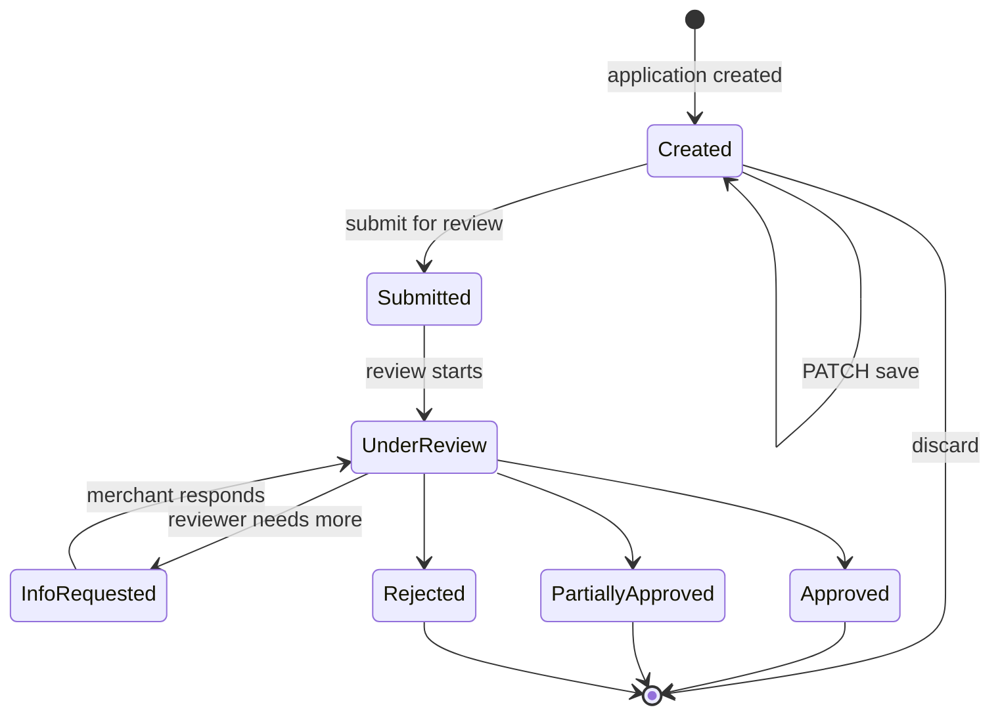

## Introduction

This post addresses **capability onboarding**: deciding **what an enrolled merchant may newly accept**. The merchant is already on file with the PSP; capability onboarding only widens scope — connecting the merchant to a new acquirer, enabling a new payment method, or extending coverage to a new currency, country, scheme, or MCC. Initial PSP enrollment is a different topic: sales-led, contract-driven, and largely off-API.

### Counterparties and Rules

The counterparties are the merchant and an **acquirer** (or wallet operator, bank, LPM partner), usually fronted by a **gateway / PSP** integration layer. **The shopper is not involved** at onboarding time — the application sets the boundaries the merchant can later initiate against at checkout.

On the **card** side, the ground rules are shared: scheme acceptance rules and the merchant's PCI program are the same reference set across brands. **LPMs** have no equivalent: each bank, wallet operator, or platform sets its own requirements, and the same rail can vary by country or tier.

### What the Merchant Submits

The information the merchant must supply ranges from **structured legal documents** (incorporation certificate, ownership, directors' IDs, licenses, bank statements, processing history) to **free-text business descriptions** (what you sell, how you fulfill, refund policy, risk controls). For a merchant already on file, the request is the **delta** — KYC and entity material the PSP already holds is reused; only what the new capability needs is collected fresh.

Automation is uneven. Card acquirers typically expose an **onboarding API** or at least a structured partner portal for submission. For many LPMs, the practical channel is still **email threads** or **shared Google Docs / spreadsheets**, with a human reviewer following up on missing or unclear fields. Even where an API exists, the review itself is not synchronous — the acquirer or bank takes time to underwrite, and outcomes span **approve**, **approve with conditions / partial approval**, **need additional documents**, and **reject**. 

### What Approval Produces

A granted capability resolves into one of two identifier outcomes:

- **New counterparty connection**: a fresh identifier is provisioned by the party being connected. For an acquirer, this is a **MID** (Merchant ID), often arriving as a **hierarchy** — one or more MIDs (by scheme, currency, or legal entity) with **store IDs** and **terminal IDs (TID)** beneath them. For an LPM partner, the identifier follows that partner's own naming — **partner ID**, **merchant code**, **app ID**, **handle**, **VPA** — and there is no universal MID equivalent.
- **Scope extension on an existing connection**: no new identifier; the existing MID or partner-side identifier's allowed scope is widened (additional currency, additional brand, raised volume cap). The merchant sees a status change in the PSP's records, not a new identifier.

When a PSP aggregates acquirers on your behalf, the **PSP-level merchant identifier** is the primary handle you keep; the underlying acquirer MIDs are managed by the PSP and may not be directly visible.

End-to-end, onboarding can take anywhere from **days** (well-prepared low-risk merchant on an integrated PSP) to **several months** (regulated category, multi-region, multiple LPMs in parallel). The dominant cost is human review over non-standard inputs.

## Integration Patterns

Onboarding is delivered through three patterns that share a single API surface underneath:

- **Embedded**: the provider renders UI inside the merchant's surface, drop-in components, web SDKs, or iFrames (Stripe Connect Embedded Components, Adyen Onboarding component, Airwallex Embedded Onboarding). The merchant keeps control of the page and navigation; the provider owns form rendering, document capture, and consent screens.
- **Hosted**: the merchant redirects the user to a provider-hosted onboarding page (Stripe hosted onboarding links, Adyen Hosted Onboarding Page, Airwallex Hosted Onboarding). The provider owns the entire flow until the user returns.
- **API**: the merchant collects every field and document in its own UI and submits via REST. The merchant owns rendering, validation, document capture, and consent capture.

> Embedded and hosted are presentation layers over the API. **Feature parity** across the three comes from routing all of them through the same requirements, application create and patch, submit, application reads, and documents operations under the hood. Those two patterns are initiated through a **short-lived session**: the merchant obtains a signed URL or client secret so the provider UI can run.

## The "Target"

Each onboarding **application** is filed against a **`target`**: the noun being provisioned. Model `target` as a top-level field. Two parts are required; `scope` is optional and varies by `target.type`.

- **`target.type`** (required): typed discriminator. Candidate values: `paymentMethod`, `region`, or more.
- **`target.code`** (required): identifier within that type. Sample values: `klarna`, `us`, `sg`.
- **`target.scope`** (optional): refines the ask. Omitting `scope` entirely requests the broadest provisioning the target supports.
    - When `target.type` is **`paymentMethod`**:
        - **`scope.currencies[]`** (optional): ISO 4217 list. Omit → all currencies the PSP offers for that method.
        - **`scope.provider`** (optional): routes to a named acquirer or partner. Omit → PSP default.
    - When `target.type` is **`region`**:
        - **`scope.paymentMethods[]`** (optional): each item is an object. Omit → every method available in that region.
            - **`code`** (required per item): payment method code within the region.
            - **`currencies[]`** (optional per item).
            - **`provider`** (optional per item).

> Production `scope` payloads carry many more fields than this sketch. Prefer **nested objects and object arrays** over flat scalars throughout `scope`, so providers can add or retire qualifiers without breaking the outer shape.

A single **`target`** can fan out to several internal capabilities: a `region` expands into multiple acquirer or method capability rows under that geography; an umbrella payment-method group expands into per-partner registrations the PSP files separately. When internal legs succeed or fail independently, the merchant sees a mixed grant — some legs live, others still blocked.

## Onboarding State Machine

The same state vocabulary applies at two levels: an aggregate `state` on the application resource, and — when a `target` fans out — a per-leg `state` on each entry in the `details` array for an internal capability. The states worth modeling explicitly are:

- `Created`: the application resource exists with a **fixed** **`target`**; the merchant may patch `data` and attach documents before filing for review. Nothing is queued to underwriting yet.
- `Submitted`: application has been filed; not yet picked up for review.
- `UnderReview`: the acquirer / PSP underwriting team is actively assessing the application.
- `InfoRequested`: the reviewer has asked for additional documents or clarifications; the ball is in the merchant's court. Returns to `UnderReview` once the merchant responds.
- `Approved`: on a `details` leg, underwriting passed for that internal capability and its scoped slice is granted. On the application, every leg has reported `Approved` and the full requested `target` scope is live.
- `PartiallyApproved`: application resource only; rolls up once every leg is terminal. Some legs are `Approved` and others `Rejected` — for example, a `region` target where some method/acquirer pairs cleared and others did not. The filing is not rejected, but transactions outside the approved subset will be declined.
- `Rejected`: on a `details` leg, underwriting refused that capability and its scoped slice is not granted. On the application, no leg is `Approved`. Usually terminal for this application; some providers support appeal or reopen paths, while others require a new application.

> Until aggregated `state` reaches a terminal underwriting outcome (`Approved`, `PartiallyApproved`, or `Rejected`), checkout and payment must not expose any capability this filing would newly grant — even when individual `details` legs already report `Approved` while other legs remain in `UnderReview` or `InfoRequested`. While the application is not final, checkout and listing read only the merchant's **already granted** scope from a provisioning read or projected catalog. This preserves application integrity by keeping in-flight leg outcomes off the live payment surface.

## Endpoints

### Requirements

- **Look up** (`POST /onboard/requirements/lookup`): returns the requirements for filing an application against a given **`target`**.
    - **Request**: the **`target`** object. Every qualifier the application needs is nested inside `target`.
    - **Response**: an ordered list of requirement entries describing exactly what the caller must supply.
        - **`key`**: dotted path under which the value is submitted.
        - **`name`**: short human-readable label, suitable for a form control.
        - **`description`**: longer help text — what the reviewer expects, examples, gotchas.
        - **`requirement`**: one of `required`, `optional`, or `conditional`. `conditional` carries a **`condition`** sub-object.
        - **`type`**: the value kind — `string`, `number`, `boolean`, `enum`, `document`, `consent`, `object`, or `array`. 
        - **`format`** (optional): per-type constraints layered on `type` — for example `enum.values`, `string.pattern` / `minLength` / `maxLength`.

### Application

- **Creation** (`POST /onboard/applications`): creates an onboarding application **without** submitting it for review. The merchant receives an `applicationId` and aggregate `state` `Created`; underwriting does not start until **`POST /onboard/applications/{applicationId}/submit`**. The **`target`** set here **does not change** on later PATCH or submit calls — if the merchant needs a different provisioning unit, they discard this application and create another. 
    - **Request**: **`target`** (required): the **`target`** object for this application — the same shape used with `POST /onboard/requirements/lookup`. **`data`** (optional): requirement values keyed by paths from that lookup for this target; omit fields the UI has not collected yet.
    - **Response**: the application resource — `applicationId`, `state`: `Created`, and usually no `details` fan-out until submit.
    - **Errors**: a malformed **`target`** returns `422 Unprocessable Entity` with structured paths; no `applicationId` is minted until create succeeds.
- **Update** (`PATCH /onboard/applications/{applicationId}`): idempotent update of `data` values. **`target`** is not patchable after create. While aggregate `state` is `Created`, PATCH is the save path before **`POST /onboard/applications/{applicationId}/submit`**. After submit, patching a specific artifact is the supported retry pattern during `InfoRequested`; do not open a second application for the same ask. When the application is in `InfoRequested`, a successful patch automatically transitions it back to `UnderReview` — there is no separate submit step. Document requirements are not patched here; use the Documents endpoints.
    - **Request**: a body keyed by requirement `key` paths (e.g. `{ "legalEntity.registrationNumber": "..." }`).
- **Submit** (`POST /onboard/applications/{applicationId}/submit`): validates the record and transitions `Created` → `Submitted` on the same `applicationId`, enqueueing underwriting. The stored **`target`** is authoritative; the submit body does not replace it.
    - **Request**: a `data` map carrying values for every requirement entry returned by `POST /onboard/requirements/lookup` for the application's **`target`**. Non-document entries carry the submitted value; each document entry carries a valid `documentId` returned from `POST /onboard/documents` under the matching requirement `key`. Upload the file on that endpoint first with the `applicationId` and requirement `key`; document resources are not nested under the application path.
    - **Response**: the application resource — `applicationId`, current overall `state`, and an optional `details` array carrying the per-capability fan-out. Each `details` entry covers one internal capability the target expanded into and carries a stable capability identifier and that leg's own `state` using the same vocabulary as the aggregate.
    - **Errors**: submitting with any `required` requirement missing — including a document requirement without a valid `documentId` at its `key` — or any `conditional` requirement whose `condition` evaluates `true` but whose value is missing, returns `422 Unprocessable Entity` with the violating requirement entries in the body. Aggregate `state` remains `Created` until submit succeeds. Calling submit when aggregate `state` is not `Created` returns a client error (for example `409 Conflict`) with a structured reason.
- **Status** (`GET /onboard/applications/{applicationId}`): reads the application resource.
    - **Response**: the application resource — `applicationId`, current overall `state`, and the optional `details` array of per-capability fan-out. Per-entry `state` and `reason` reflect each leg's latest outcome. While any leg is still pending, the aggregate `state` should remain `UnderReview`; once every leg has reported, the aggregate shows `Approved`, `PartiallyApproved`, or `Rejected`, with structured rejection reasons where applicable. 
      - When a leg sits in `InfoRequested`, its `details` entry carries a `requirements` array — the additional data, documents, or consents the LPM or acquirer needs before deciding, in the same entry shape as `POST /onboard/requirements/lookup`. The aggregate rolls up to `InfoRequested` while any leg is asking; supplying the requested values via `PATCH /onboard/applications/{applicationId}` (data) or `POST /onboard/documents` (documents) clears that leg and returns it to `UnderReview`.
- **Withdraw** (`DELETE /onboard/applications/{applicationId}`): withdraws the application before decision, including deleting an unsubmitted application in `Created`.
- **Webhook**: the provider's push channel so the merchant learns when asynchronous review moves an application — an outbound `POST` to the merchant's registered URL.
    - **Payload**: JSON body in the same shape as the `GET /onboard/applications/{applicationId}` response, reflecting the application after the `state` change that triggered the webhook (for example into `Submitted` from `Created`, into `InfoRequested`, or to `Approved` / `PartiallyApproved` / `Rejected`). Many providers omit push for intermediate `Created` PATCH saves and only notify once the filing enters `Submitted` or later.
    - **Acknowledgement**: the merchant responds with `200 OK` with a fixed-contract body the provider documents; other status codes or malformed acks typically trigger retries.

### Documents

- **Upload document** (`POST /onboard/documents`): uploads a document and binds it to a specific document requirement on an application. The path does not embed `applicationId`; the caller supplies it alongside the requirement `key` in the multipart or companion metadata block. The same call applies while aggregate `state` is `Created`, once the merchant holds an `applicationId`.
    - **Request**: multipart upload — `applicationId`, `key` (the document requirement being satisfied), the file binary, and optional metadata (`type`, `purpose`).
    - **Response**: a `documentId` for the stored document. The corresponding requirement entry flips from unsatisfied to satisfied; if this completes the application's outstanding requirements while it sits in `InfoRequested`, the application transitions back to `UnderReview`.
- **Read document** (`GET /onboard/documents/{documentId}`): reads document metadata and review state.
- **Remove document** (`DELETE /onboard/documents/{documentId}`): removes a document. Meaningful only before the underwriter commits to a decision.

## The Five Lenses

- **Semantics**: answer one question: *"May this merchant submit transactions of type X, in country Y, on rail Z?"* Output is a scope grant on the existing enrollment — additional brands, MCCs, currencies, geographies, or partner registrations — plus, when the requested target fans out to a new acquirer connection, a fresh credentialed identity (MID or LPM-equivalent).
- **State model**: the state machine above is the source of truth from `Created` through terminal underwriting outcomes. `Created` is pre-review: the merchant edits freely until a successful `POST /onboard/applications/{applicationId}/submit`; only `InfoRequested` is non-final once review has started — underwriting pauses until the merchant supplies what was asked, then the application returns to `UnderReview`. When the `target` fans out, the aggregate stays `UnderReview` until every leg has reported, then rolls up to `Approved`, `PartiallyApproved`, or `Rejected`.
- **Recovery**: the merchant-side retry loop is **resubmitting a specific artifact**, not re-filing a new application for the same ask. If the merchant creates another application whose `target` is the same as, overlaps, or lies inside an application already in flight for that merchant — including one still in `Created` — the provider should reject the new application and return a pointer to the existing `applicationId` (typically `422` with a structured reason), not mint a second record. Well-designed onboarding APIs anchor on an **application id** (idempotent updates), expose **per-artifact upload endpoints**, and return **structured rejection reasons** ("license document unreadable", "MCC not permitted") so follow-up can be automated instead of email-threaded.
- **Time discipline**: review SLAs are bounded for cards at PSPs that publish one (hours to a few days) and mostly unbounded for manually handled LPMs. **Document validity** windows apply, so long-paused applications force re-collection. Some programs require periodic re-validation, including annual PCI evidence cycles and, in specific cases, scheme-program renewals. When the grant becomes effective for live traffic is rarely a first-class field on the application resource; it follows review outcome plus scheme, acquirer, or PSP operational rules (activation, clearing cutoffs, MID boarding lag).
- **Observability**: two modes, both required: a **status query** on the application or a **provisioning read** of the merchant as the source of truth, and **status webhooks** for transitions (`Submitted`, `InfoRequested`, `Approved`, `PartiallyApproved`, `Rejected`). 

## Summary

Capability onboarding extends an enrolled merchant so it can initiate or accept payments on additional rails and payment methods, in new geographies and currencies, after the provider approves the widened scope. The same underwriting and filing work runs whether the merchant uses embedded components, a hosted redirect flow, or a native API — only the presentation layer changes.

That provisioning is the foundation for payment checkout: listing and selecting payment methods at runtime draw on a catalog that *projects* the granted capability set, filtered for the session (amount, currency, country, channel, shopper).

-----
## Appendix

### Appendix A: Provider Docs

- **Stripe (Connect):** [Connect capabilities](https://docs.stripe.com/connect/account-capabilities), [Update a capability](https://docs.stripe.com/api/capabilities/update), [Update merchant profile](https://docs.stripe.com/api/accounts/update), [Handle verification with the API](https://docs.stripe.com/connect/handling-api-verification).
- **Adyen (Platforms / LEM):** [Legal Entity Management v4](https://docs.adyen.com/api-explorer/legalentity/latest/overview), [Update a legal entity](https://docs.adyen.com/api-explorer/legalentity/latest/patch/legalEntities/_id_), [Capabilities for Adyen for Platforms](https://docs.adyen.com/marketplaces-and-platforms/verification-overview/).
- **Airwallex (connected merchants):** [Capabilities](https://www.airwallex.com/docs/connected-accounts/about/account-capabilities), [Payment methods list](https://www.airwallex.com/docs/connected-accounts/onboarding/kyb-and-onboarding/native-api/payment-method-list), [Native API onboarding](https://www.airwallex.com/docs/connected-accounts/onboarding/kyc-and-onboarding/native-api).
- **Checkout.com (Platforms):** [Onboard sub-entities](https://www.checkout.com/docs/platforms/onboard-sub-entities), [Submit application via API](https://www.checkout.com/docs/platforms/onboard-sub-entities/submit-application/onboard-with-the-api), [Handle webhooks](https://www.checkout.com/docs/platforms/onboard-sub-entities/handle-webhooks), [Add supporting documents](https://www.checkout.com/docs/platforms/for-payfac/onboard-sub-entities/add-supporting-documents).
- **Worldpay (Access, parties model):** [Parties API](https://docs.worldpay.com/access/products/parties), [Access APIs index](https://docs.worldpay.com/access/apis), [Worldpay for Platforms onboarding](https://resource-center.worldpayforplatforms.com/wp4p/merchant-onboarding-via-api).
- **Worldline (Onboarding API, NAM docs):** [Onboarding API introduction (NAM)](https://docs.na.worldline-solutions.com/build-your-integration/onboarding-api/onboarding-api-introduction/), [Onboarding API overview (NAM)](https://docs.na.worldline-solutions.com/build-your-integration/onboarding-api/onboarding-api-introduction/overview), [Worldline Connect API Explorer](https://docs.connect.worldline-solutions.com/documentation/api-explorer).
- **Antom (Merchant Service / AMS):** [Merchant onboarding](https://docs.antom.com/ac/merchant_service/merchant_onboard), [Merchant administration](https://docs.antom.com/ac/merchant_service/account_manage), [Merchant registration API](https://docs.antom.com/ac/ams/registration).

### Appendix B: Sellers, merchants, and PSP models

Hold three roles distinct. A **seller** transacts with end shoppers through the merchant's storefront, app, or integration layer; sellers do not contract the PSP. The **merchant** holds the PSP relationship: it signs the acceptance contract, owns the MID or partner identifiers, and decides how sellers (if any) sit beneath it. The **PSP** runs the acquirer-facing and rail-facing infrastructure — underwriting, capability provisioning, processing, settlement, and the onboarding APIs this post describes. The main post assumes no seller layer; capability onboarding widens what a single enrolled merchant may accept. This appendix covers the cases where the merchant runs a population of sellers and must decide how each seller maps onto the PSP relationship. **Merchant–PSP relationship models** are the contract and operating shape between those two parties. **Seller programs** are what changes when the merchant onboards sellers beneath that relationship. 

- **Direct merchant**: the merchant is the only party the PSP enrolls for card acceptance. There is no seller layer at the PSP; capability onboarding in the sections above applies as written.
- **PayFac (merchant-held license)**: the merchant holds the PayFac registration with the schemes through a sponsoring acquirer and operates a master MID. Sellers are scheme **sponsored merchants** beneath the merchant; the merchant underwrites sellers and settles to them after sponsor settlement to the master account. Examples: Square, Toast.
- **Platform**: the merchant is a **software platform or technical integrator** built on the **PSP**'s PayFac infrastructure rather than holding its own license, and it onboards sellers as connected accounts or sub-entities through its own UI or API. Examples: Stripe Connect, Adyen for Platforms, Airwallex connected accounts, Checkout.com sub-entities. Consumer programs layered on top (for example Shopify Payments on Stripe Connect) inherit this shape.
- **Marketplace** (a defined Visa entity type): the merchant is a marketplace operator that sells on behalf of sellers under Visa's marketplace classification. Sellers have no acquirer relationship; the merchant underwrites and monitors them under marketplace rules. Examples: Uber, Airbnb, eBay.
- **Merchant of Record (MoR)**: the merchant is the legal merchant for every card transaction. Sellers onboard for payout, tax, and AML only — not card acceptance. Examples: Paddle, Lemon Squeezy, FastSpring, Apple App Store, Google Play.

#### Comparing merchant–PSP models

Compare merchant–PSP models on the axes below. The table that follows applies them to each model, with **direct merchant** as the baseline (no seller layer).

- **Contracted card merchant**: who appears on the acquirer agreement and the cardholder statement — the merchant, each seller, or the MoR.
- **Scheme registration**: whether the merchant holds its own PayFac or marketplace registration, sits on the PSP's registration, or has none.
- **Underwriting owner**: whether the merchant, the PSP per seller, or the marketplace owns the accept/deny decision for sellers.
- **Settlement path**: whether net settlement lands on the merchant first or on each seller's balance.
- **Shopper-facing merchant**: whether checkout and the statement present the seller, the merchant, or both.
- **Chargeback and refund liability**: whether disputes land on the seller, the merchant, or the MoR.

| Merchant's role | Who underwrites sellers | Shopper buys from | PSP settles to |
| --- | --- | --- | --- |
| **Direct merchant** | **Merchant**. | **Merchant**. | **Merchant**. |
| **PayFac** | **Merchant** (sponsor acquirer or **PSP** audits the program). | **Seller** (statement descriptor may include a **merchant** or PayFac prefix). | **Merchant**, on the master account; the **merchant** then settles sellers. |
| **Platform** | **PSP**, per seller. | **Seller** (statement may show the **merchant** depending on charge type). | **Seller** balance at the **PSP**; the **merchant** may take fees or splits first. |
| **Marketplace** | **Merchant**, under scheme marketplace rules. | **Merchant** (statement may post the seller per configuration). | **Merchant** (some programs settle sellers directly). |
| **MoR** | **Merchant**, for payout, tax, and AML only — sellers are not card acceptors. | **Merchant** (legal seller, even when the product is shown on the seller's site). | **Merchant** only; sellers are paid downstream by the **merchant**. |

