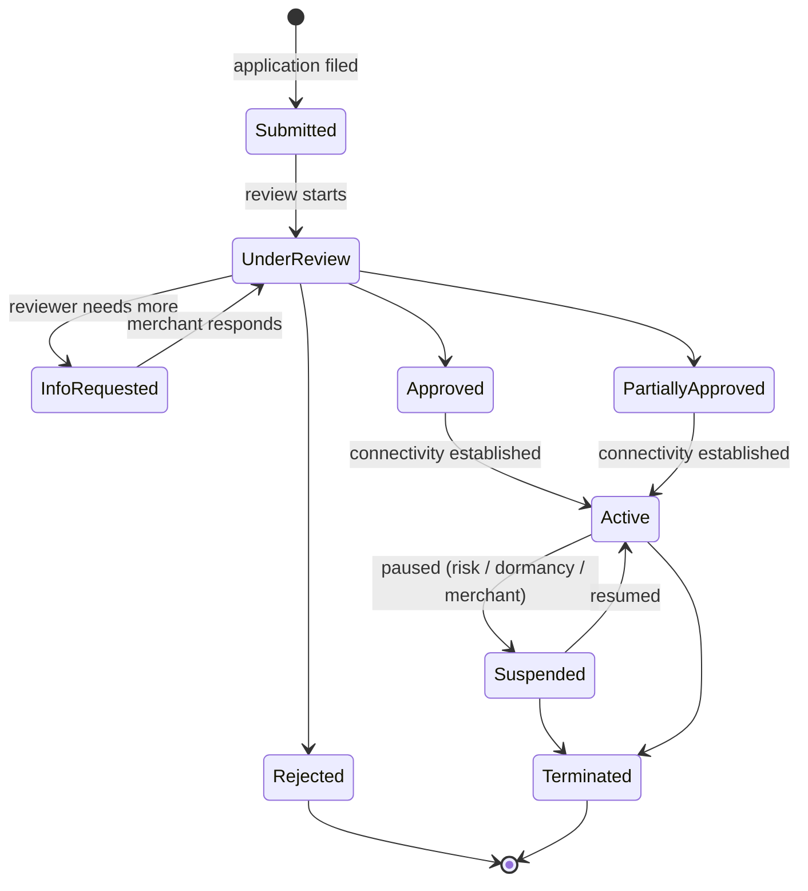

Onboarding establishes **who the merchant is**, **what they are allowed to accept**, and **how they will technically connect**. The counterparties are the merchant and an **acquirer** (with a **PSP** commonly in between to facilitate). **The shopper is not involved yet** — onboarding only sets the boundaries for everything the merchant will later initiate at checkout.

For cards, onboarding is anchored by **scheme rules**: PCI, branding, MCC (Merchant Category Code), permitted products, and cardholder-data handling are all defined at the network level, and the acquirer enforces them on sponsored merchants. For **LPMs** there is no single scheme analog. Requirements differ by **bank**, **wallet operator**, or **platform**, and even the same rail can vary by country or tier.

The information the merchant must supply ranges from **structured legal documents** (incorporation certificate, ownership, directors' IDs, licenses, bank statements, processing history) to **free-text business descriptions** (what you sell, how you fulfill, refund policy, risk controls).

Automation is uneven. Card acquirers typically expose an **onboarding API** or at least a structured partner portal for submission. For many LPMs, the practical channel is still **email threads** or **shared Google Docs / spreadsheets**, with a human on the other end requesting clarifications. Even where an API exists, the review itself is not synchronous — the acquirer or bank takes time to underwrite, and outcomes span **approve**, **approve with conditions / partial approval**, **need additional documents**, and **reject**. Merchants must not assume the API response is the final word, and must instead rely on a status channel: a query endpoint, a webhook, or both.

A successful onboarding typically yields a **MID** (Merchant ID):
- Card onboarding often produces a **hierarchy** of identifiers — one or more MIDs (per scheme, per currency, per legal entity), with **store IDs** and **terminal IDs (TID)** beneath them.
- For marketplaces and platforms, additional **sub-merchant** or **payfac sub-account** identifiers sit under the platform's master MID.
- LPMs use their own terminology — **partner ID**, **merchant code**, **app ID**, **handle**, **VPA** — and there is no universal equivalent of a MID.
- When a PSP aggregates acquirers on your behalf, the **PSP-level account ID** is what you integrate against; the underlying acquirer MIDs are managed by the PSP and may not be directly visible to you.

Onboarding also rarely ends at the identifier. Follow-up steps establish the **communication channels**: exchanging public keys (or client certificates) for API calls, setting up an **SFTP** server and credentials for settlement and dispute reports, whitelisting IPs, configuring webhook endpoints, and sometimes terminal provisioning for in-person flows. Each sub-step can itself be reviewed. End-to-end, onboarding can take anywhere from **days** (well-prepared low-risk merchant on an integrated PSP) to **several months** (regulated category, multi-region, multiple LPMs in parallel). The dominant cost is human review over non-standard inputs, not technical integration.

### Onboarding State Machine

The application and the resulting MID share a single lifecycle. The states worth modeling explicitly:

- `Submitted` — application has been filed; not yet picked up for review.
- `UnderReview` — the acquirer / PSP underwriting team is actively assessing the application.
- `InfoRequested` — the reviewer has asked for additional documents or clarifications; the ball is in the merchant's court. Returns to `UnderReview` once the merchant responds.
- `Approved` — underwriting passed for the full requested scope (brands, MCCs, currencies, geographies). Not yet transactable until connectivity is configured.
- `PartiallyApproved` — underwriting passed for a strict subset of the requested scope. The application is not rejected, but later transactions outside the approved scope will be declined. **This is the state most integrations forget to model**, and the missing scope surfaces downstream as unexplained declines.
- `Rejected` — underwriting refused and no MID is produced. Terminal for this application — to retry, the merchant must file a new one.
- `Active` — MID is provisioned, communication channels (keys, SFTP, webhooks, IPs) are established, and the merchant can submit transactions.
- `Suspended` — a previously active MID has been paused: voluntarily, by dormancy policy, or due to risk / compliance review. No new authorizations are accepted; in-flight obligations (settlement, disputes, refunds) continue.
- `Terminated` — MID is permanently closed. Settlement of in-flight items continues but no new transactions can be initiated. Effectively final.

### The Five Lenses

- **Semantics** — answer one question: *"May this merchant submit transactions of type X, in country Y, on rail Z, from date D?"* Output is a credentialed identity, a scope (brands, MCCs, currencies, volumes, entity), and the channels through which subsequent capabilities will be invoked.
- **State model** — the state machine above is the source of truth. `PartiallyApproved` is the trap most integrations miss; `InfoRequested` is the only non-terminal state where the *merchant* holds the next action; `Rejected` and `Terminated` are final.
- **Recovery** — the merchant-side retry loop is **resubmitting a specific artifact**, not re-running the application. Well-designed onboarding APIs anchor on an **application id** (idempotent updates), expose **per-artifact upload endpoints**, and return **structured rejection reasons** ("license document unreadable", "MCC not permitted") so follow-up can be automated instead of email-threaded.
- **Time discipline** — review SLAs are bounded for cards at PSPs that publish one (hours to a few days) and mostly unbounded for manually handled LPMs. **Document validity** windows apply (bank statement within 90 days, ID document within 12 months), so long-paused applications force re-collection. Some scheme programs require **annual re-registration**.
- **Observability** — two modes, both required: a **status query** on the application or MID as the source of truth, and **status webhooks** for transitions (`InfoRequested`, `Approved`, `PartiallyApproved`, `Suspended`). Long-term observability also needs a **merchant profile read API** — which MIDs are mine, under which entity, which brands, which caps — because staleness here causes unexplained declines downstream.
