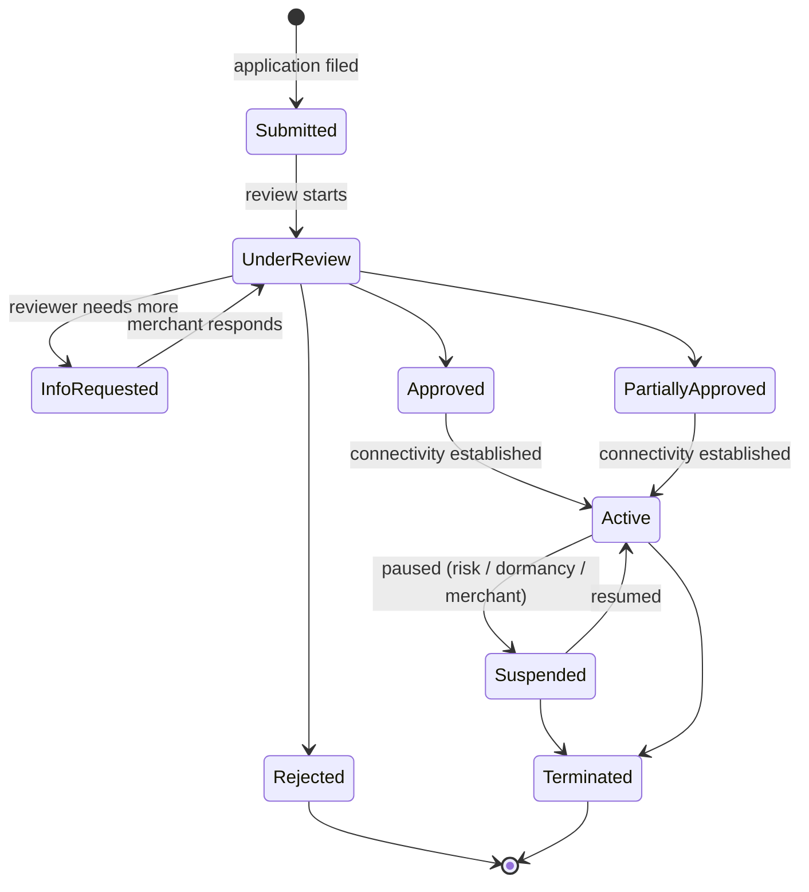
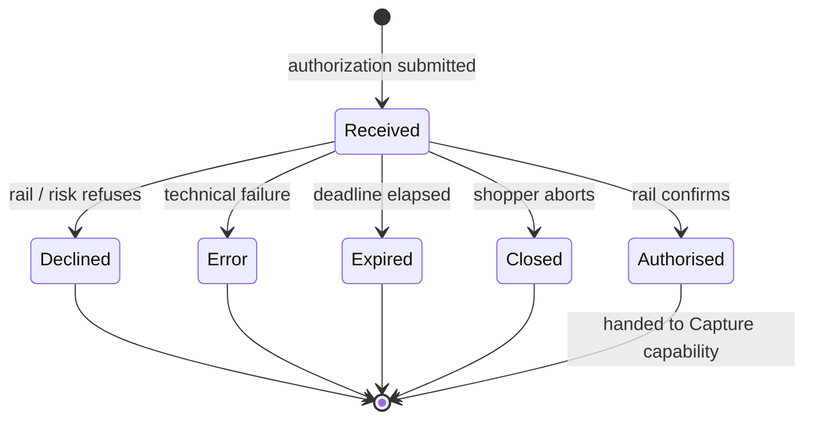
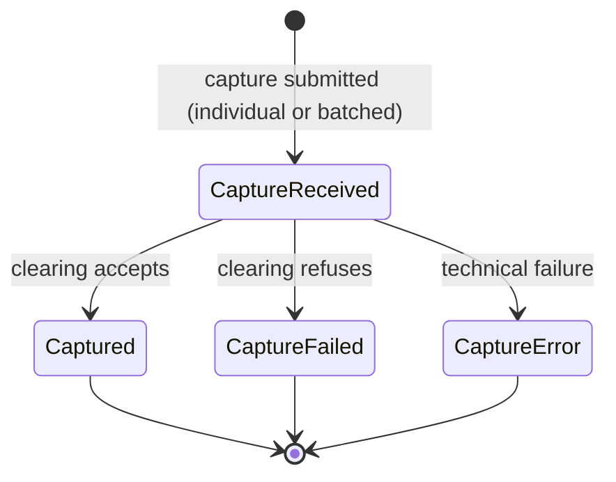
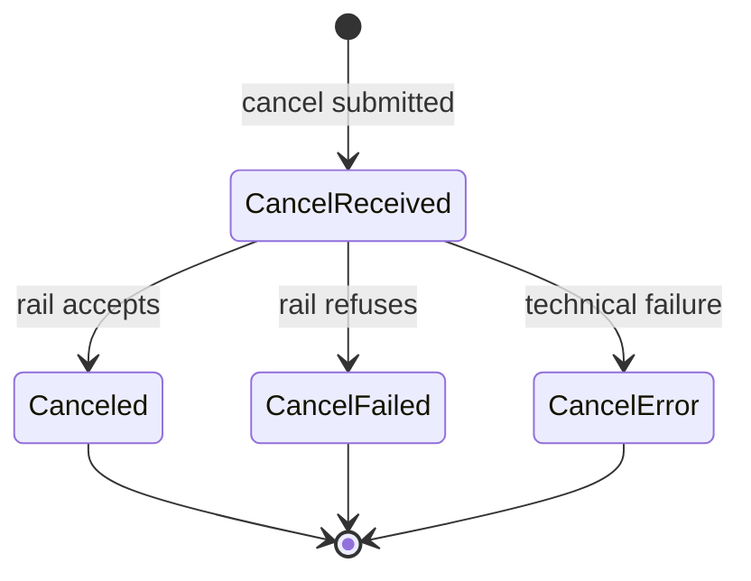

## Introduction

In the [previous blog]() we walked through the payment ecosystem and lifecycle, and introduced **payment capabilities** as the merchant-facing operations and signals that make each phase reliable and observable.

We closed with a short list — authorize, capture, cancel, refund, status check, tokenize, charge with saved token, and mandate lifecycle. This blog enumerates the capabilities across the **entire lifecycle** and describes each one through a consistent five-lens framework.

## The Five Lenses

Each capability is described from the same five angles. The frame is worth spelling out once, because what makes capabilities *different across rails* is rarely whether they exist — it is how they behave under each lens.

- **Semantics** — what the capability does and does not do. The input/output contract, and the single question it answers.
- **State model** — the statuses it produces or transitions, and the allowed transitions between them. Which states are terminal, which are asynchronous, and where the next step lives.
- **Recovery** — how to stay correct under retries, timeouts, partial failures, duplicate webhooks, and out-of-order events. Idempotency anchors, reconciliation primitives, and safe fallbacks.
- **Time discipline** — the clocks and windows that govern the capability: review SLAs, expirations, capture windows, representment deadlines, settlement lags.
- **Observability** — how the merchant learns the current state and the history behind it: synchronous responses, status queries, webhooks, reports, and reconciliation files.

## Onboarding

Onboarding establishes **who the merchant is**, **what they are allowed to accept**, and **how they will technically connect**. The counterparties are the merchant and an **acquirer** (with a **PSP** commonly in between to facilitate). **The shopper is not involved yet** — onboarding only sets the boundaries for everything the merchant will later initiate at checkout.

For cards, onboarding is anchored by **scheme rules**: PCI, branding, MCC (Merchant Category Code), permitted products, and cardholder-data handling are all defined at the network level, and the acquirer enforces them on sponsored merchants. For **LPMs** there is no single scheme analog. Requirements differ by **bank**, **wallet operator**, or **platform**, and even the same rail can vary by country or tier.

The information the merchant must supply ranges from **structured legal documents** (incorporation certificate, ownership, directors' IDs, licenses, bank statements, processing history) to **free-text business descriptions** (what you sell, how you fulfill, refund policy, risk controls).

Automation is uneven. Card acquirers typically expose an **onboarding API** or at least a structured partner portal for submission. For many LPMs, the practical channel is still **email threads** or **shared Google Docs / spreadsheets**, with a human on the other end requesting clarifications. Even where an API exists, the review itself is not synchronous — the acquirer or bank takes time to underwrite, and outcomes span **approve**, **approve with conditions / partial approval**, **need additional documents**, and **reject**. Merchants must not assume the API response is the final word, and must instead rely on a status channel: a query endpoint, a webhook, or both.

A successful onboarding typically yields a **MID** (Merchant ID):
- Card onboarding often produces a **hierarchy** of identifiers — one or more MIDs (per scheme, per currency, per legal entity), with **store IDs** and **terminal IDs (TID)** beneath them.
- For marketplaces and platforms, additional **sub-merchant** or **payfac sub-account** identifiers sit under the platform's master MID.
- LPMs use their own terminology — **partner ID**, **merchant code**, **app ID**, **handle**, **VPA** — and there is no universal equivalent of a MID.
- When a PSP aggregates acquirers on your behalf, the **PSP-level account ID** is what you integrate against; the underlying acquirer MIDs are managed by the PSP and may not be directly visible to you.

Onboarding also rarely ends at the identifier. Follow-up steps establish the **communication channels**: exchanging public keys (or client certificates) for API calls, setting up an **SFTP** server and credentials for settlement and dispute reports, whitelisting IPs, configuring webhook endpoints, and sometimes terminal provisioning for in-person flows. Each sub-step can itself be reviewed. End-to-end, onboarding can take anywhere from **days** (well-prepared low-risk merchant on an integrated PSP) to **several months** (regulated category, multi-region, multiple LPMs in parallel). The dominant cost is human review over non-standard inputs, not technical integration.

### Onboarding State Machine

The application and the resulting MID share a single lifecycle. The states worth modeling explicitly:

- `Submitted` — application has been filed; not yet picked up for review.
- `UnderReview` — the acquirer / PSP underwriting team is actively assessing the application.
- `InfoRequested` — the reviewer has asked for additional documents or clarifications; the ball is in the merchant's court. Returns to `UnderReview` once the merchant responds.
- `Approved` — underwriting passed for the full requested scope (brands, MCCs, currencies, geographies). Not yet transactable until connectivity is configured.
- `PartiallyApproved` — underwriting passed for a strict subset of the requested scope. The application is not rejected, but later transactions outside the approved scope will be declined. **This is the state most integrations forget to model**, and the missing scope surfaces downstream as unexplained declines.
- `Rejected` — underwriting refused and no MID is produced. Terminal for this application — to retry, the merchant must file a new one.
- `Active` — MID is provisioned, communication channels (keys, SFTP, webhooks, IPs) are established, and the merchant can submit transactions.
- `Suspended` — a previously active MID has been paused: voluntarily, by dormancy policy, or due to risk / compliance review. No new authorizations are accepted; in-flight obligations (settlement, disputes, refunds) continue.
- `Terminated` — MID is permanently closed. Settlement of in-flight items continues but no new transactions can be initiated. Effectively final.

### The Five Lenses

- **Semantics** — answer one question: *"May this merchant submit transactions of type X, in country Y, on rail Z, from date D?"* Output is a credentialed identity, a scope (brands, MCCs, currencies, volumes, entity), and the channels through which subsequent capabilities will be invoked.
- **State model** — the state machine above is the source of truth. `PartiallyApproved` is the trap most integrations miss; `InfoRequested` is the only non-terminal state where the *merchant* holds the next action; `Rejected` and `Terminated` are final.
- **Recovery** — the merchant-side retry loop is **resubmitting a specific artifact**, not re-running the application. Well-designed onboarding APIs anchor on an **application id** (idempotent updates), expose **per-artifact upload endpoints**, and return **structured rejection reasons** ("license document unreadable", "MCC not permitted") so follow-up can be automated instead of email-threaded.
- **Time discipline** — review SLAs are bounded for cards at PSPs that publish one (hours to a few days) and mostly unbounded for manually handled LPMs. **Document validity** windows apply (bank statement within 90 days, ID document within 12 months), so long-paused applications force re-collection. Some scheme programs require **annual re-registration**.
- **Observability** — two modes, both required: a **status query** on the application or MID as the source of truth, and **status webhooks** for transitions (`InfoRequested`, `Approved`, `PartiallyApproved`, `Suspended`). Long-term observability also needs a **merchant profile read API** — which MIDs are mine, under which entity, which brands, which caps — because staleness here causes unexplained declines downstream.

## Authorize

Authorization is the most consequential capability in the lifecycle. It **marks the start of a payment**, and it is where the most parties interact: shopper, merchant, PSP, acquirer, scheme or rail operator, issuer, and — on many LPMs — a wallet or platform sitting alongside the bank. Every substantive check happens inside this one call: **risk scoring**, **authentication of the payer**, **fraud screening**, **funds / balance check**, **velocity and regulatory limits**, **sanctions / AML**. A payment is only authorized once all of these pass.

**Cards vs alternative methods split at the end of this step.** For cards, authorization reserves funds but does **not** move them; a separate **capture** is required to push the transaction into clearing. For most LPMs, the split does not exist: authorization and capture happen **together** in a single shopper action — when the rail confirms the transfer, the money is already on its way, and there is no second capture instruction to send. The capture capability from the next section is effectively a no-op on those rails. **Vouchers and offline-confirmation LPMs are the exception**: like cards, they are two-step — the rail issues a reference at authorization time, and the actual payment confirmation arrives later (sometimes days later) when the shopper completes the payment off-rail.

### Card Authorization Flows

On cards, three shapes dominate:

- **Challenge flow** — the issuer requires an explicit interaction from the shopper to authenticate. The shopper is taken (inline iframe or full redirect) to the issuer's 3-D Secure ACS page and completes a challenge: OTP, bank-app push, biometric confirmation inside the banking app, or password. When the challenge finishes, the browser returns to the merchant and the merchant finalizes authorization with the authentication evidence (CAVV/ECI) attached.
- **Frictionless flow** — the issuer authenticates the shopper from device, transaction, and behavioral data alone and authorizes without any shopper interaction. 3-D Secure still runs (authentication evidence is still produced), but the challenge step is skipped and the merchant never leaves its own surface.
- **Non-3DS / SCA-exempt** — issuer authorises directly from the auth message; common in markets without an SCA mandate, for low-value or merchant-initiated transactions, and under regulator-approved exemptions (TRA, low-value, allowlist).

Either way, the merchant gets a **synchronous, final authorization outcome** once any authentication and the auth message complete — `Authorised`, `Declined`, or `Error`, with no fourth bucket called *"we'll let you know in a few minutes."* The whole chain runs on tight, scheme-enforced clocks: the issuer answers the auth message in seconds (and if it doesn't, the scheme returns a **stand-in** decision in its place), and the 3-D Secure challenge itself is bounded to a few minutes by the ACS. The only pending-shaped edge cases are recovery scenarios — the shopper's browser doesn't return cleanly from the ACS, or the merchant times out mid-call — and even those resolve within minutes via **status query** or **auth reversal**, not a multi-hour wait.

### LPM Authorization Flows

Where cards converge on the two shapes above, LPMs are far more diverse — they were designed to fit local markets and user behavior rather than a single rail. The channels worth distinguishing:

- **Browser redirect** to the bank or wallet login (the closest analog to card 3DS). Examples: **iDEAL** (NL), **Bancontact** (BE), **Trustly** (Nordics / EU).
- **QR code** — merchant displays a dynamic QR; the shopper scans it with their bank or wallet app. Examples: **PIX** (BR), **UPI QR** (IN), **Alipay** / **WeChat Pay** (CN).
- **Deeplink / universal link** — on mobile, the merchant app hands off to the bank or wallet app natively and returns on approval. Examples: **Apple Pay**, **Google Pay**, **GrabPay** (SEA).
- **In-app / super-app context** — entirely inside a wallet or super-app; no handoff to a separate environment. Examples: **WeChat Pay**, **Alipay** (CN), **Kakao Pay** (KR).
- **Push notification** — a notification into the shopper's bank or wallet app that the shopper opens to approve. Examples: **Swish** (SE), **MobilePay** (DK / FI), **Bizum** (ES).
- **SMS** — an OTP or link sent to the shopper's phone to confirm the charge. Examples: **direct carrier billing** (Boku, Fortumo), legacy SMS-OTP flows on regional cards.
- **Embedded code entry** — the shopper types a code generated elsewhere directly on the merchant page; the merchant relays it to the rail. Examples: **BLIK** (PL, 6-digit code from the bank app), **M-Pesa STK PIN** (KE).
- **Voucher / pay-by-code** — merchant shows a reference; the shopper pays later at a store counter, ATM, or via online banking. Examples: **Boleto Bancário** (BR), **OXXO Pay** (MX), **Konbini** (JP).
- **Bank transfer with reference** — the shopper initiates a push credit from their own banking app to a merchant-supplied account + reference. Examples: **SEPA Credit Transfer** (EU), **Faster Payments** (UK), **PIX copy-and-paste key** (BR).
- **Manual / offline confirmation** — the final confirmation lands through a non-interactive channel minutes to days after the shopper's action. Examples: **cash on delivery** (IN, SEA, LATAM), **bank wire** reconciled manually.

The common property across all of these channels is that **the shopper leaves the merchant's environment** (often the PSP's and rail operator's environments too) to complete the payment. Nobody in the processing chain has direct visibility into what the shopper is doing until the rail reports back. The authorization result is therefore **asynchronous by nature** — not a special case, the default. Reliable integrations depend on **status queries**, **webhooks**, or both, and must not conflate "API returned" with "payment succeeded."

### Authorization State Machine

Because authorization can be async and the shopper isn't always reachable, every robust integration treats an authorization as a stateful resource with a bounded **expiry** — the wall-clock deadline after which, if no final outcome has arrived, the authorization is no longer redeemable. When supported, the expiry should be **shared across all parties**: the acquirer includes it in the request to the issuer or rail operator, and echoes it back to the merchant on the response, so everyone agrees on the same clock. The merchant closes the order once expiry passes; the issuer or rail rejects any confirmation arriving after it.

The states an authorization moves through:

- **`Received`** — the only non-terminal state. The authorization has been submitted and the expiry clock is running. Every other state is a transition out of `Received`.
- **`Authorised`** — the rail confirmed before expiry. On cards (two-step), this leaves an **authorization hold** that waits for a capture instruction. On most LPMs, the rail-level confirmation already moved the funds, so the subsequent **Capture** is a no-op — but the Authorize state machine still terminates here at `Authorised`. Either way, every downstream capability — capture, cancel, refund, dispute, settlement match — operates on the authorization once it reaches `Authorised`, not on the Authorize capability itself.
- **`Declined`** — any party in the chain (issuer, rail operator, fraud engine, acquirer, PSP) refused to proceed and returned a negative final result before expiry.
- **`Error`** — connectivity loss, malformed responses, signature mismatches, or unrecoverable downstream errors prevented a clean outcome. Distinct from `Declined` because no party actually decided — the system failed to carry the decision.
- **`Expired`** — the deadline elapsed without a final result. The integration triggers an **auth reversal** automatically (a void if the rail supports it, otherwise a refund on any funds that may have landed despite the expiry) so no money is held in an ambiguous state.
- **`Closed`** — the shopper explicitly aborted the flow (pressed **back**, **cancel**, or closed the bank app mid-challenge). Distinct from `Expired`: the trigger is an active shopper action, not a timeout.

### The Five Lenses

- **Semantics** — confirm payer intent and obtain rail authorisation **before** (cards) or **together with** (LPMs) the money movement. Input: amount, currency, merchant context, payment instrument (PAN, token, bank handle, wallet payload), and an expiry. Output: a final disposition — `Authorised`, `Declined`, `Error`, `Expired`, or `Closed` — and, once authorised, either an **authorization hold** (cards, two-step) or a completed funds movement (most LPMs), plus **authentication evidence** (CAVV / ECI, SCA result) where the rail produces one.
- **State model** — one in-flight state (`Received`, waiting for the rail's final result) and five terminal outcomes: `Authorised`, `Declined`, `Error`, `Expired`, `Closed`. The in-flight phase may internally distinguish sub-stages (awaiting authentication, awaiting shopper action, awaiting rail confirmation) for diagnostics, but every transition out of `Received` lands in exactly one terminal. The post-authorisation transition — from auth hold to captured — belongs to the **Capture** capability, not Authorize.
- **Recovery** — **idempotency keys** on the authorization request are mandatory: the same key replayed after a network-level timeout must return the *same* authorization attempt and never create a duplicate. Lost responses are resolved by **status query** or **auth reversal**, never by blind replay without a key. `Error` outcomes require operator-grade investigation via status query: the rail is the source of truth, and the merchant must be able to diff its local authorization records against the rail's view. On `Expired`, the integration issues the automatic auth reversal and stays safe against the rare "late success" where the rail confirms after the deadline — the reversal then becomes a **refund** on any funds that landed. `Declined` outcomes carry categories (**issuer decline**, **risk decline**, **soft decline / do-retry**, **hard decline / do-not-retry**) so downstream business-retry policies stay safe.
- **Time discipline** — the authorization's **expiry** is the primary clock and must be propagated to every party that can honor it. Beyond that, rail-specific sub-clocks apply: a 3DS challenge has a challenge timeout; bank redirects have session timeouts; voucher LPMs hold the reference for hours to days; authorization **holds** (post-authorisation, pre-capture, on cards and two-step LPMs) have their own validity (typically 7 days on cards, longer for travel and lodging). The `Expired` transition is rarely pushed reliably as an event and must be detected by polling.
- **Observability** — synchronous response when the rail allows it; **webhook** on every state transition (terminal outcomes — `Authorised`, `Declined`, `Error`, `Expired`, `Closed` — plus intermediate sub-stages worth exposing for diagnostics); **status query** on the authorization id (and, where supported, the idempotency key) as the ultimate tiebreaker. The query must return the current state plus the artifacts produced by authorisation itself (auth code or rail reference, authentication evidence, hold validity for two-step cards, decline reason where applicable), and must be safely repeatable so the merchant can sweep authorizations stuck in `Received` after a missed webhook, a signature-verification failure, or a recovery from a merchant-side outage.

## Capture

Capture is the instruction that turns an authorization into money the merchant will actually receive. **Whether it is a separate call at all depends on the rail's message model.** The card industry names the split directly:

- **Single-Message System (SMS)** — also called `sale` or `purchase` — folds authorization and clearing into a single message, and there is no separate capture instruction.
- **Dual-Message System (DMS)** — `auth + capture`, sometimes labelled **two-step** in PSP documentation — reserves funds first and requires a separate capture call to push the transaction into clearing.

Most card credit traffic is DMS; PIN debit and many regional debit schemes default to SMS.

LPMs do not share a formal label, but the same split shows up in their flows. The majority — **PIX**, **iDEAL**, **Bancontact**, **UPI**, **Swish**, **BLIK**, **Alipay**, **WeChat Pay** — are SMS-equivalent: when the rail confirms the shopper's action, funds are already moving and the Capture capability is a no-op. **Vouchers and offline-confirmation LPMs** — **Boleto**, **OXXO**, **Konbini**, **cash on delivery** — are DMS-equivalent: authorization issues a reference, and a separate confirmation (a capture call, or in some cases a settlement-side credit notice) lands once the shopper completes the off-rail step.

The remainder of this section addresses the **DMS** case. On SMS rails the Capture capability is still exposed on the API surface — so a single integration can drive both message models — but the call is a **no-op**: no clearing instruction is dispatched to the rail, and the state machine below transitions directly to `Captured` once authorization succeeds.

### Individual vs Batch Capture

Even on rails that require an explicit capture, there are two operational shapes the merchant can choose between:

- **Individual capture, after a delay** — the merchant issues a **per-authorization capture call** as soon as the underlying obligation is fulfilled. The delay between authorize and capture ranges from minutes to days, bounded by the rail's **capture window** (typically 7 days on cards, extended to around 30 days for travel and lodging by scheme agreement). Examples: an e-commerce shop captures when the warehouse hands the order to the carrier (capture-on-shipment, also encouraged by scheme rules); a hotel captures at check-out for the final stay total, after one or more **incremental authorizations** along the way to extend the hold and adjust the running amount; a car-rental company captures when the vehicle is returned and incidentals are reconciled; a marketplace captures the buyer's authorization once the seller marks the order shipped.
- **Batch capture, at cutoff** — the merchant accumulates authorizations and submits them as a single file at the acquirer's **clearing cutoff** (typically end-of-day in the acquirer's local time). This is the legacy default — card-present terminals batch-settled this way long before online auth APIs existed — and remains standard for high-volume backend flows. Some acquirers extend the model with **auto-capture at cutoff**, sweeping any authorization the merchant has neither captured nor cancelled into the batch; convenient, but it surrenders the merchant's deadline as a control. 
  
Modern PSPs more commonly expose a **hybrid**: per-authorization capture calls at the API surface, internally aggregated into a single submission at the acquirer's cutoff, preserving per-call observability while the rail still receives one batch. Examples: a card-present POS batch-settling at close-of-business; a transit operator aggregating a rider's same-day taps into a single **fare-capped** capture once the day's pattern is known; a subscription platform submitting a daily batch of MIT renewal captures.

### Capture Variants

Independent of the timing model above, capture supports several amount variants beyond a full one-shot capture, all subject to rail- and scheme-specific rules. **Partial capture** sends less than the authorized amount (out-of-stock line item, shortened hotel stay) and releases the unused balance back to the issuer. **Multiple captures** apply several captures against the same authorization with the cumulative sum capped at the authorized total (split-shipment orders, multi-seller marketplace fulfillment); not every rail supports it. **Over-capture** — capturing above the authorized amount — is permitted by the card schemes only within narrow tolerance bands and only for specific MCCs (lodging, car rental, restaurants for tip-and-gratuity, food delivery for tip adjustment); outside those bands the merchant must re-authorize for the higher amount. **Force capture** — capturing without a matching live authorization — exists for offline-terminal recovery on cards, but is disallowed or heavily scrutinized by most acquirers because of elevated chargeback risk.

On SMS rails these variants do not apply natively — capture is the authorization — so the equivalent business outcomes are achieved through **separate transactions** (split-shipment), **refunds** (over-billing), and rail-specific exceptions like **PIN-debit tip adjustment**, the only place an SMS clearing message gets re-amounted after the fact.

### Capture State Machine

Capture is **asynchronous on every DMS rail**. The acquirer accepts the capture instruction, schedules it into a clearing window, and confirms the outcome later — often via webhook hours after submission, and on batch flows only after the acquirer has processed the batch. Every robust integration therefore treats a capture as its own stateful object, distinct from the parent authorization.

> **Note on PSP API surfaces:** Some modern PSP APIs return a synchronous *captured* response by resolving optimistically on acquirer-acceptance rather than scheme-clearing. The underlying clearing is still asynchronous, and the merchant's reconciliation must treat it as such — a synchronous API result is not a substitute for the settlement record.

The states a capture moves through:

- **`CaptureReceived`** — the only non-terminal state. The capture has been accepted by the acquirer (individually or as part of a batch) and is in flight toward clearing.
- **`Captured`** — clearing accepted the capture. The amount is now owed to the merchant and will surface on the next settlement cycle.
- **`CaptureFailed`** — clearing refused the capture. Common causes: the underlying authorization expired before the capture reached the rail, the capture amount exceeded the authorized amount, the issuer revoked the hold, or scheme rules rejected the late presentment. Distinct from `CaptureError` because clearing actually decided.
- **`CaptureError`** — the capture could not be carried through cleanly: connectivity loss with the acquirer, malformed batch file, signature mismatch, or unrecoverable downstream errors. No party decided; the system failed to deliver the instruction. Resolved via **status query** and idempotent replay on the same capture reference.

### The Five Lenses

- **Semantics** — convert a prior authorization into a **collectable transaction** by instructing the acquirer to present it into clearing. Required on DMS rails (cards in their dual-message configuration, vouchers, offline-confirmation LPMs); implicit and no-op on SMS rails (PIN-debit card schemes, most LPMs). Supports **full**, **partial**, and on some rails **multiple captures** against the same authorization. Capture decides what is owed; it is not settlement.
- **State model** — one in-flight state (`CaptureReceived`) and three terminal outcomes: `Captured`, `CaptureFailed`, `CaptureError`. Partial captures produce per-capture instances and a remaining authorized balance that drains to zero or expires with the parent authorization.
- **Recovery** — idempotent on a **capture reference** so retries do not double-capture. After a `CaptureError`, the safe primitive is **status query** on the capture reference followed by a replay using the same idempotency key — never a blind retry, which risks a double-capture if the original instruction reached the rail. Partial-capture overruns must fail deterministically, not silently widen.
- **Time discipline** — the **capture window** is rail- and contract-specific (typical cards: 7 days; lodging / auto-rental: longer by agreement; many LPMs: immediate-only). Late captures carry both cost and decline risk: they trigger **interchange downgrades** into higher-rate categories, increase the likelihood of an **issuer decline at clearing** as the original authorization ages, and are rejected as `CaptureFailed` once the window has elapsed. At that point the capture's lifecycle is terminally closed, and the merchant must return to **Authorize** (with fresh SCA where required) before any collection is possible. Batch flows add a second clock — the acquirer's **clearing cutoff** — that determines which day's settlement a capture lands in.
- **Observability** — webhook on every transition (`Captured`, `CaptureFailed`, `CaptureError`); status query exposing authorized vs captured amounts and remaining balance; capture line items on the daily settlement report as the final reconciliation source. For batch flows, a **batch acknowledgement** linking each capture line to its enclosing batch is required — without it, individual `CaptureError` causes are invisible inside an otherwise-accepted batch.

## Cancel

Cancel is the instruction that releases an **active authorization hold** before it is captured. It only makes sense in the **DMS** model, where authorization reserves funds without moving them and a separate capture is required to push the transaction into clearing — which is also why the capability is variously called `void`, `cancel`, `reverse authorization`, or `auth reversal` across PSPs and schemes. On **SMS** rails the money has already moved by the time authorization succeeds, so there is no hold to release; the equivalent business outcome is a **refund**, and a cancel call against an SMS payment is rejected as not-applicable.

The primary use is **proactive** — the merchant releases the hold themselves rather than waiting for the authorization's expiry to do it. Reasons span the order lifecycle: shopper changes their mind before shipment, out-of-stock detected after authorize, fraud signal lands between authorize and capture, hotel guest cancels before check-in. Letting the hold sit until expiry instead — typically 7 days on cards, longer for travel and lodging — keeps the shopper's available credit or available balance reduced for no reason and is a common source of customer complaints.

### Partial Cancel

A **partial cancel** — also called a **partial reversal** in scheme messaging — releases part of an authorization hold while leaving the remainder live for later capture. Both Visa and Mastercard define the message; **not every acquirer exposes it**, and many PSP API surfaces omit it because the use case overlaps with **partial capture** (capturing less than the authorized amount implicitly releases the unused balance).

The case where partial cancel is the right primitive — and partial capture is not — is when the merchant wants to **reduce the hold without capturing anything yet**. Examples: one line item in a multi-item order falls through but the rest still has not shipped, so capture is premature. Multiple partial cancels can stack against the same authorization, each reducing the remaining authorized balance, until the balance reaches zero (effectively a full cancel) or the merchant captures whatever is left.

> **LPMs essentially never support partial cancel.** The few rails that expose any cancel at all expose only the full-amount form, and on most LPMs even that does not exist.

### Cancel After Capture Is Submitted

The interesting failure mode is when the merchant has already submitted a capture. The outcome depends on **which state the capture has reached** in its own lifecycle:

- **Capture in `CaptureReceived` (pre-cutoff).** The acquirer accepted the capture instruction but it is still sitting in the pending batch and has not been presented to the scheme. On many cards-on-acquirer combinations the cancel is treated as a **pull-from-batch** — the line is removed before the batch flushes, no clearing happens, no interchange is charged, and the cardholder never sees a posted charge or a refund line. PSP API surfaces vary on this: some route a `cancel` call here automatically, some require an explicit `void`, some refuse the call and force the merchant to refund regardless. The rail behavior, not the API verb, is the source of truth.
- **Capture in `Captured` (post-cutoff).** Clearing has accepted the capture; money is on its way to settlement and there is no hold left to release. The cancel call fails because the capture has already cleared, and the merchant must switch to **refund** — a separate money movement back to the shopper. Two consequences are merchant-visible: the cardholder sees **both a posted charge and a separate refund line** on their statement (very different from a true cancel, which leaves no trace), and the merchant **still pays interchange and scheme fees** on the original capture even though the net funds movement is zero.

A genuine **race** between capture and cancel arriving in the same window is resolved by the rail's deterministic ordering on the authorization id: **whichever lands first wins**, and the loser is rejected with a deterministic error indicating the prior operation has already taken effect — either the capture has already been accepted (cancel lost), or the cancel has already been processed (capture lost). The integration must be idempotent on both legs and route to the appropriate remediation — refund the captured amount, or accept the cancel — without retrying the loser blindly.

### Cancel State Machine

Cancel is **typically synchronous at the API surface** — the acquirer accepts or refuses the cancel in the same call, in seconds — because no clearing instruction is dispatched and no batch needs to drain. A handful of LPMs that expose a cancel at all (rare; most do not) confirm asynchronously via webhook, and the integration should not assume one shape over the other.

> **Note on issuer-side hold release:** A synchronous `Canceled` response from the acquirer does **not** mean the hold has disappeared from the cardholder's statement. Issuers release holds on their own cadence — minutes to several days — and the cardholder may continue to see a *pending* line until the issuer processes the reversal. The rail state and the cardholder-visible state are distinct, and merchant support flows must answer for both.

The states a cancel moves through:

- **`CancelReceived`** — the only non-terminal state. The cancel has been accepted by the acquirer and is in flight toward the rail. On rails that resolve synchronously, this state is transient and never externally observed; on rails that confirm via webhook it persists until the rail responds.
- **`Canceled`** — the rail accepted the cancel and the authorization hold is released at the rail (issuer-visible release lags as noted above). Alias `Voided` on cards. The parent authorization transitions to `Canceled` at the same time.
- **`CancelFailed`** — the rail refused the cancel. Common causes: the authorization was already captured, already expired, or the acquirer rejected the request for scheme-rule reasons. Distinct from `CancelError` because the rail actually decided.
- **`CancelError`** — connectivity loss, malformed request, signature mismatch, or unrecoverable downstream errors prevented a clean outcome. Resolved via **status query** on the cancel reference and idempotent replay — never a blind retry.

### The Five Lenses

- **Semantics** — release an active authorization hold before capture so no stray capture happens and the shopper's available credit / balance is restored. Supports **full** and, on rails that expose it, **partial cancel** (also called *partial reversal*); LPMs essentially never support either. **DMS-only by definition**; cancel does not apply on SMS rails, where the equivalent business outcome is a **refund**. Same intent, different names: `void`, `cancel`, `reverse authorization`, `auth reversal`.
- **State model** — valid only when the parent authorization is in `Authorised` (post-auth, pre-capture). One in-flight state (`CancelReceived`, often unobserved on synchronous rails) and three terminal outcomes: `Canceled`, `CancelFailed`, `CancelError`. Partial cancels produce per-cancel instances and a remaining authorized balance that drains toward zero or is later captured. The parent authorization transitions to `Canceled` once the remaining balance reaches zero. Cancelling after capture is not this capability — it is a **refund**.
- **Recovery** — idempotent on the original authorization reference (and on a merchant-supplied cancel reference where the API exposes one) so retries do not double-cancel or trigger spurious already-canceled errors. A cancel that races a capture must fail deterministically — the response indicates the capture has already been accepted — so the integration switches to refund cleanly. After a `CancelError`, the safe primitive is **status query** on the authorization, not a blind retry that risks acting on a stale view.
- **Time discipline** — the cancel window is bounded by **two clocks**, whichever comes first. On cards, voids are free and must reach the acquirer before the **clearing cutoff** (typically end-of-day in the acquirer's local time); after the cutoff the operation degrades to a refund even when the API label stays the same. The authorization's own **expiry** is the other ceiling — once it elapses the cancel call hits a terminal state. Many LPMs expose no cancel at all; the only cancellation path is letting the pending authorization expire.
- **Observability** — synchronous response on rails that confirm in-call; webhook on the `Canceled` / `CancelFailed` transition where the rail is async; status query that distinguishes `Canceled` (hold released, no money moved) from `Refunded` (money moved both ways). 

## Refund

- **Semantics** — return money to the shopper after a successful capture, linked to the original payment. Supports **full** and typically **partial** refunds, and on most rails **multiple partial refunds** up to the captured amount.
- **State model** — a refund is its own object with its own lifecycle: `RefundInitiated` → (`RefundSucceeded` | `RefundFailed`). The parent payment moves to `Refunded` or `PartiallyRefunded` as refunds accumulate.
- **Recovery** — idempotent on a merchant-supplied refund reference so retries never over-refund. Partial-refund arithmetic is enforced server-side (sum of refunds ≤ captured). Some LPMs reject refunds after a rail-specific window, and the only recovery is an **out-of-band credit** the integration cannot see.
- **Time discipline** — refund settlement lags capture settlement by days on most rails. Rail-specific **refund windows** apply: several months on most card schemes, shorter on many LPMs, effectively none on cash-voucher methods. Currency-mismatched refunds add FX-timing variance.
- **Observability** — webhook per refund object; status query on the parent payment showing the refunded totals; reconciliation report exposing each refund as its own line so net settlement can be computed without replaying transactions.

## Tokenize

- **Semantics** — create and store a **reusable reference** to a payment credential (card PAN, bank account, wallet handle) so later charges can be issued without retaining raw credential data. Output is a **token id** bound to instrument metadata (brand, last4, expiry, country) and, for cards, optionally a **network token** provisioned by the Visa or Mastercard token service.
- **State model** — `TokenRequested` → `Active` → (`Suspended` | `Expired` | `Deleted`). `Suspended` is driven by issuer events (reported lost or stolen) and is where the mandate / agreement capability below engages.
- **Recovery** — idempotent on a client-supplied reference so a retried provisioning call does not create a second token for the same card. Tokenization failures must be typed (`invalid_card`, `vault_unavailable`, `network_token_unavailable` with **PSP-vault fallback**) so the merchant can degrade gracefully instead of failing checkout.
- **Time discipline** — card tokens carry the underlying card's expiry. **Account updater** services refresh expiry and PAN-on-file changes silently, on their own cadence. Bank-debit tokens carry a mandate expiry. LPM tokens often carry a provider-enforced inactivity expiry.
- **Observability** — webhook on token lifecycle events (`token.updated`, `token.suspended`, `token.deleted`); a **list tokens by shopper** query as the source of truth, because merchant-side databases drift from the vault over time.

### Charge with Saved Token (CIT / MIT)

- **Semantics** — reuse a stored token to authorize (and optionally capture) a new payment. The important distinction is **who initiated the transaction**: **CIT** (customer-initiated, shopper present and confirming) vs **MIT** (merchant-initiated, shopper not present). Same token, same rails, but different scheme indicators and different issuer risk rules.
- **State model** — same transaction state machine as a first-time authorize / capture, plus a **link** to the original CIT that established the stored-credential agreement. Missing or broken linkage is itself a state worth modeling — issuers decline MITs that reference no valid original CIT.
- **Recovery** — idempotent on a merchant-supplied transaction reference. MIT-specific decline categories (`issuer_decline_mit_not_permitted`, `cardholder_canceled_agreement`) must disable further MIT retries and, where appropriate, prompt a CIT re-authorization rather than a blind retry.
- **Time discipline** — MIT **category indicators** must be correct on every charge (recurring, installment, unscheduled, reauthorization). Missing or wrong categories cause unexpected declines and are a common cause of silent revenue loss.
- **Observability** — every MIT charge must be observable both as a transaction and as a **usage event of the underlying agreement**, so "why did this renewal decline?" can be answered without reconstructing history from auth logs.

### Mandate / Agreement Lifecycle

- **Semantics** — record, retrieve, update, and revoke shopper consent for repeat charging, so token reuse stays auditable and compliant. On cards this is the **stored-credential agreement** implied by the initial CIT; on SEPA Direct Debit, UPI AutoPay, iDEAL-in-3, or wallet subscriptions it is an **explicit mandate** with its own identifier and lifecycle.
- **State model** — `Pending` → `Active` → (`Paused` | `Revoked` | `Expired`). Revocation originates from the **shopper**, **issuer**, **rail operator**, or **merchant**, and each origin has different downstream effects on pending charges.
- **Recovery** — the merchant-side view of mandate state must be refreshed from the rail, not inferred from successful charges. A **silently revoked** mandate keeps failing until an explicit `mandate.revoked` event is ingested. Where the rail does not push events, periodic **reconciliation** against the provider's mandate list is the only safe path.
- **Time discipline** — many mandates expire after a period of **inactivity** or on a **fixed term**. SEPA Direct Debit enforces a pre-notification window. UPI AutoPay enforces a 24-hour pre-debit notification. Each becomes a pre-charge capability in its own right.
- **Observability** — mandate-events webhook; mandate list / query endpoint; and a join between mandate id and transactions so revenue on a revoked mandate is zero by construction.

## Dispute / Chargeback

- **Semantics** — respond to a shopper-initiated challenge on a **captured, settled** charge. The merchant-side capability is less about raising disputes and more about **receiving cases, submitting evidence, accepting liability, and reading outcomes** under scheme or rail rules.
- **State model** — `CaseOpened` → `EvidenceRequested` → (`EvidenceSubmitted` → `AwaitingArbitration`) → (`Won` | `Lost` | `Accepted`). Representment and arbitration layers extend the state machine on cards. LPMs often collapse the whole thing into `Opened` → (`Resolved` | `Rejected`) with no evidence loop.
- **Recovery** — idempotent evidence submission on a **dispute id** so the inevitable re-uploads (larger file, extra document) update the same case instead of creating a duplicate. A retry of "submit evidence" after the deadline must hard-fail rather than silently no-op.
- **Time discipline** — the strictest clocks in the lifecycle. Scheme representment windows are measured in days (commonly 7–30 depending on reason code), and missing them is the difference between winnable and lost. **Reason-code-specific deadlines** must surface on the dispute object, not be buried in documentation.
- **Observability** — webhook on every case transition; a dispute query returning the reason code, deadline, evidence already submitted, and expected outcome date; a **monthly dispute report** that reconciles `Accepted`, `Won`, and `Lost` volumes against settlement adjustments.

## Settlement / Payout

- **Semantics** — the merchant-observable side of the money movement: the acquirer (or PSP) **pays out** the net amount owed to the merchant's bank account under the merchant contract. Input is the set of captured, refunded, and adjusted transactions over a period. Output is a **payout** credited to a bank account, minus fees, reserves, and adjustments.
- **State model** — a payout has its own object: `Scheduled` → `InTransit` → (`Paid` | `Failed` | `Returned`). `Failed` or `Returned` payouts (closed bank account, wrong IBAN) reopen a reconciliation loop the merchant must handle as first-class state.
- **Recovery** — the acquirer retries the bank transfer on its own schedule. The merchant cannot force a payout but must be able to **update the bank account** and **trigger a resend** for returned payouts. Idempotency on the payout reference is the anchor.
- **Time discipline** — payout cadence is contractual (daily, T+2, weekly, monthly). **Rolling reserves** hold a percentage for the dispute window. FX payouts add conversion-date and conversion-rate variance.
- **Observability** — payout webhook on each transition (`Scheduled`, `Paid`, `Failed`); payout list / query; and — most importantly — a **payout breakdown** that links each line to the underlying transaction, fee, refund, or dispute. Without that link, the merchant can balance the top line but cannot answer "why was this payout smaller than expected?"

### Reconciliation & Reporting

- **Semantics** — provide the **authoritative record** of every money-moving event in a form that can be joined against the merchant's own ledger. Usually delivered as a **daily settlement report** over SFTP or object storage, plus a **transaction-level export API**.
- **State model** — reports themselves are stateful: `Generating` → `Available` → `Superseded` (when the provider issues corrections). Integrations that ingest only "the latest report for yesterday" silently miss amendments.
- **Recovery** — reports are idempotent by **report id**, so reprocessing is safe. Transactions must carry **stable external ids** across authorize, capture, refund, and dispute so joins hold over the full object lifetime.
- **Time discipline** — three distinct clocks govern reporting: **generation lag** (hours after the cutoff), the **amendment window** (days to weeks), and **archive retention** (months to years). Finance teams care about all three.
- **Observability** — the report is itself the observability surface, but only if it carries, per line, the fields that matter for reconciliation: scheme or rail id, acquirer reference, merchant reference, fee components, FX rate, settlement currency, and the linked payout id.

## Cross-Cutting

### Status Query

- **Semantics** — read the **current authoritative state** of any object (application, payment, refund, token, mandate, dispute, payout) by id. This is the capability merchants fall back to whenever the other channels disagree or go silent.
- **State model** — none of its own; it returns the state of other objects. What matters is **what fields it exposes**: not just the top-level status but the sub-states, timestamps, and linked object ids needed to make the state actionable.
- **Recovery** — the primary recovery primitive for the whole API surface. Every capability above implicitly assumes status query exists and is consistent with webhooks. If the two disagree, the query should be the tiebreaker.
- **Time discipline** — freshness matters more than latency. A query that returns data minutes stale during a settlement cutoff is worse than a query that is slower but current. Providers should document **maximum staleness**, not just p99 latency.
- **Observability** — the capability is itself observability, but the important meta-property is **completeness**: is there an object type you can receive a webhook for but not query? Any such asymmetry is a reliability bug.

### Webhooks / Event Stream

- **Semantics** — push state transitions from the provider to the merchant so polling is not the only path. Every lifecycle state transition must be expressible as an event.
- **State model** — events carry their own delivery state: `Pending` → (`Delivered` | `Failed` → `Retrying` → `DeadLettered`). Dead-lettered events must be retrievable and replayable, or gaps in the merchant's view of the world become unrecoverable.
- **Recovery** — **signed**, **ordered where it matters**, **at-least-once delivered**, **replayable from a cursor**. Every consumer must be idempotent on the event id. Out-of-order delivery across objects is tolerable. Out-of-order delivery within a single object's lifecycle is not.
- **Time discipline** — delivery SLA, retry schedule, and retention window (how far back can I replay?) are the three clocks. A retention window shorter than the dispute window is a recurring source of data loss.
- **Observability** — the merchant must be able to inspect **failed deliveries**, **replay by id or time range**, and **filter by event type** without opening a support ticket.

### Status Query vs Webhook

> **TODO:** expand this comparison. Candidate structure:
>
> - When to use which, and why both are needed rather than one.
> - Latency, freshness, and completeness trade-offs.
> - Ordering, duplicates, and retries — who owns what.
> - Failure modes of each in isolation (silent webhook loss; stale query caches) and how the pair compensates.
> - A side-by-side table across: direction, cardinality, latency, ordering, replay, retention, auth model, and typical failure modes.

## Offboarding

Offboarding closes the loop that onboarding opened. It is rarely discussed because it is rarely automated, but it is a capability in its own right.

- **Semantics** — wind down a merchant's ability to transact on a MID (or the whole account) while preserving live obligations: pending settlements, open disputes, refund liability, and reporting access.
- **State model** — `Active` → `Closing` → `Closed`. `Closing` is a potentially long state that continues to accept refunds and disputes while blocking new authorizations.
- **Recovery** — `Closing` must be resumable when offboarding was triggered in error. `Closed` is terminal to prevent accidental reactivation.
- **Time discipline** — the dispute-window tail drives how long `Closing` must last. Scheme rules often require retaining transactional data for years after the last transaction.
- **Observability** — a final **statement** / **report bundle**, plus continued read access to historical data through the retention window.

## Closing

The capabilities above are the **functional surface** merchants actually operate against across the whole lifecycle. They are not equally mature across rails — onboarding and dispute handling in particular vary wildly between card acquirers and LPM operators — and the five-lens framing is what makes those differences concrete rather than anecdotal.

In the next blog we use this list as the comparison grid: we pick a few leading PSP APIs and score them, capability by capability and lens by lens, so the gaps between the marketing surface and the operational surface become visible.
