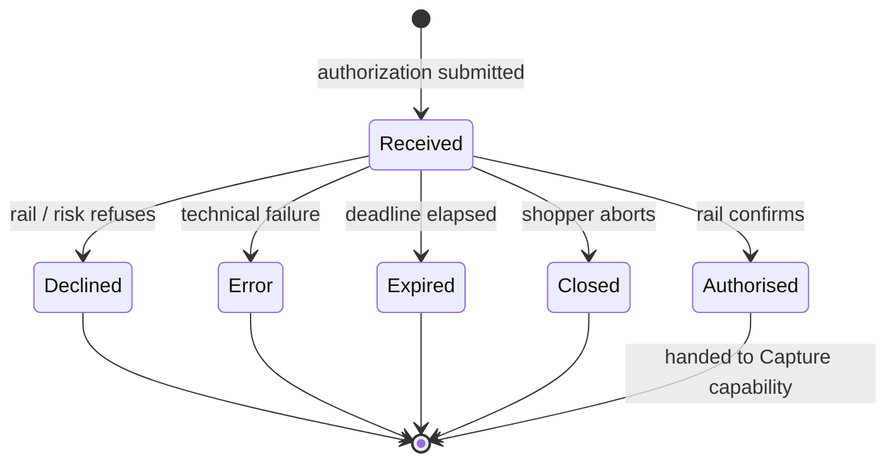

Authorization is the most consequential capability in the lifecycle. It **marks the start of a payment**, and it is where the most parties interact: shopper, merchant, PSP, acquirer, scheme or rail operator, issuer, and — on many LPMs — a wallet or platform sitting alongside the bank. Every substantive check happens inside this one call: **risk scoring**, **authentication of the payer**, **fraud screening**, **funds / balance check**, **velocity and regulatory limits**, **sanctions / AML**. A payment is only authorized once all of these pass.

**Single-Message vs Dual-Message at the rail level.** Authorization terminates differently depending on whether authorization and clearing travel as **one message** or **two** — a foundational distinction that the rest of this post leans on. The card industry names the split directly:

- **Single-Message System (SMS)** — also called `sale` or `purchase` — folds authorization and clearing into a single message, and there is no separate capture instruction. When authorization succeeds, the money is already moving.
- **Dual-Message System (DMS)** — `auth + capture`, sometimes labelled **two-step** in PSP documentation — reserves funds first and requires a separate capture call to push the transaction into clearing. Authorization leaves an **authorization hold** that the merchant later captures or releases.

Most card credit traffic is DMS; PIN debit and many regional debit schemes default to SMS.

LPMs do not share a formal label, but the same split shows up in their flows. The majority — **PIX**, **iDEAL**, **Bancontact**, **UPI**, **Swish**, **BLIK**, **Alipay**, **WeChat Pay** — are **SMS-equivalent**: when the rail confirms the shopper's action, funds are already moving and the Capture capability is a no-op. **Vouchers and offline-confirmation LPMs** — **Boleto**, **OXXO**, **Konbini**, **cash on delivery** — are **DMS-equivalent**: authorization issues a reference, and a separate confirmation (a capture call, or in some cases a settlement-side credit notice) lands once the shopper completes the off-rail step.

This split governs which downstream capabilities apply: **Capture** is required on DMS rails and a no-op on SMS; **Cancel** exists only on DMS (it releases an authorization hold that SMS rails never create); **Refund** exists everywhere.

### Card Authorization Flows

On cards, three shapes dominate:

- **Challenge flow** — the issuer requires an explicit interaction from the shopper to authenticate. The shopper is taken (inline iframe or full redirect) to the issuer's 3-D Secure ACS page and completes a challenge: OTP, bank-app push, biometric confirmation inside the banking app, or password. When the challenge finishes, the browser returns to the merchant and the merchant finalizes authorization with the authentication evidence (CAVV/ECI) attached.
- **Frictionless flow** — the issuer authenticates the shopper from device, transaction, and behavioral data alone and authorizes without any shopper interaction. 3-D Secure still runs (authentication evidence is still produced), but the challenge step is skipped and the merchant never leaves its own surface.
- **Non-3DS / SCA-exempt** — issuer authorises directly from the auth message; common in markets without an SCA mandate, for low-value or merchant-initiated transactions, and under regulator-approved exemptions (TRA, low-value, allowlist).

Either way, the merchant gets a **synchronous, final authorization outcome** once any authentication and the auth message complete — `Authorised`, `Declined`, or `Error`, with no fourth bucket called *"we'll let you know in a few minutes."* The whole chain runs on tight, scheme-enforced clocks: the issuer answers the auth message in seconds (and if it doesn't, the scheme returns a **stand-in** decision in its place), and the 3-D Secure challenge itself is bounded to a few minutes by the ACS. The only pending-shaped edge cases are recovery scenarios — the shopper's browser doesn't return cleanly from the ACS, or the merchant times out mid-call — and even those resolve within minutes via **status query** or **auth reversal**, not a multi-hour wait.

### LPM Authorization Flows

Where cards converge on the two shapes above, LPMs are far more diverse — they were designed to fit local markets and user behavior rather than a single rail. The channels worth distinguishing:

- **Browser redirect** to the bank or wallet login (the closest analog to card 3DS).
- **QR code** via bank or wallet app.
- **Deeplink / universal link** handoff from merchant app to bank/wallet app.
- **In-app / super-app context** with no handoff.
- **Push notification** approval in bank/wallet app.
- **SMS** approval or OTP.
- **Embedded code entry** (for example BLIK code).
- **Voucher / pay-by-code** flows completed later in store/ATM/online banking.
- **Bank transfer with reference** pushed by the shopper.
- **Manual / offline confirmation** arriving minutes to days later.

The common property across all of these channels is that **the shopper leaves the merchant's environment** (often the PSP's and rail operator's environments too) to complete the payment. Nobody in the processing chain has direct visibility into what the shopper is doing until the rail reports back. The authorization result is therefore **asynchronous by nature** — not a special case, the default. Reliable integrations depend on **status queries**, **webhooks**, or both, and must not conflate "API returned" with "payment succeeded."

### Authorization State Machine

Because authorization can be async and the shopper isn't always reachable, every robust integration treats an authorization as a stateful resource with a bounded **expiry**.

- **`Received`** — submitted; expiry clock running.
- **`Authorised`** — confirmed before expiry.
- **`Declined`** — refused by a party in the chain before expiry.
- **`Error`** — technical failure prevented a clean outcome.
- **`Expired`** — deadline elapsed with no final outcome.
- **`Closed`** — shopper explicitly aborted.

### The Five Lenses

- **Semantics** — confirm payer intent and obtain rail authorisation **before** (DMS rails) or **together with** (SMS rails) the money movement.
- **State model** — one in-flight state (`Received`) and five terminal outcomes: `Authorised`, `Declined`, `Error`, `Expired`, `Closed`.
- **Recovery** — idempotency key on authorization request; status query/auth reversal for uncertain outcomes.
- **Time discipline** — expiry is primary; rail-specific sub-clocks (3DS, redirects, voucher hold windows) still apply.
- **Observability** — synchronous response where available, plus webhooks and status query as the tiebreaker.
