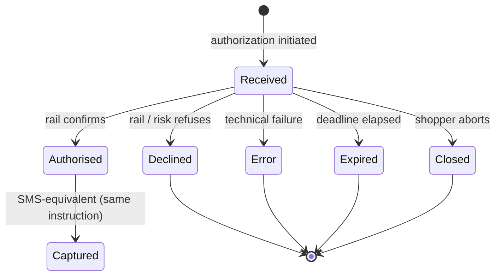
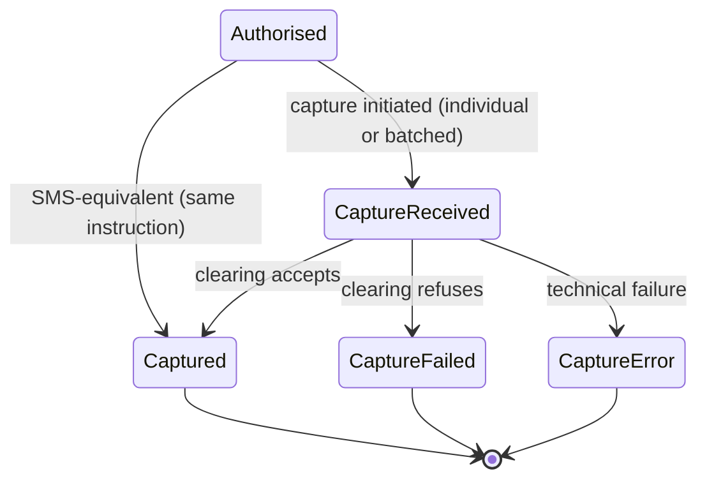

## Introduction

Authorization is the most consequential capability in the lifecycle. It **marks the start of a payment**, and it is where the most parties interact: shopper, merchant, PSP, acquirer, scheme or rail operator, issuer, and — on many LPMs — a wallet or platform sitting alongside the bank. Every substantive check happens inside this one call: **risk scoring**, **authentication of the payer**, **fraud screening**, **funds / balance check**, **velocity and regulatory limits**, **sanctions / AML**. A payment is only authorized once all of these pass.

On **dual-message (DMS)** rails, that approval is only a **hold** until **capture** presents the transaction into clearing for the amount the merchant is owed. On **single-message (SMS)** and SMS-equivalent rails, **one instruction** reaches **`Authorised`** and **`Captured`** together — there is no hold and no separate merchant capture call.

## Single-Message vs Dual-Message 
Authorization terminates differently depending on whether authorization and clearing travel as **one message** or **two** — a foundational distinction that the rest of this post leans on. The card industry names the split directly:

- **Single-Message System (SMS)**: also called `sale` or `purchase` — folds authorization and clearing into a single message, and there is no separate capture instruction. When authorization succeeds, the money is already moving.
- **Dual-Message System (DMS)**: `auth + capture`, sometimes labelled **two-step** in PSP documentation — reserves funds first and requires a separate capture call to push the transaction into clearing. Authorization leaves an **authorization hold** that the merchant later captures or releases.

Most card credit traffic is DMS; PIN debit and many regional debit schemes default to SMS.

LPMs do not share a formal label, but the same split shows up in their flows. The majority — **PIX**, **iDEAL**, **Bancontact**, **UPI**, **Swish**, **BLIK**, **Alipay**, **WeChat Pay** — are **SMS-equivalent**: when the rail confirms the shopper's action, funds are already moving and the Capture capability is a no-op. **Vouchers and offline-confirmation LPMs** — **Boleto**, **OXXO**, **Konbini**, **cash on delivery** — are **DMS-equivalent**: authorization issues a reference, and a separate confirmation (a capture call, or in some cases a settlement-side credit notice) lands once the shopper completes the off-rail step.

This split governs which downstream capabilities apply: **Capture** is required on DMS rails and a no-op on SMS; **Cancel** exists only on DMS (it releases an authorization hold that SMS rails never create); **Refund** exists everywhere.

## Authorization

The shape of the authorization call varies by rail and channel: a frictionless card flow closes in a single API round-trip, while a 3DS challenge, a redirect, a wallet handoff, or a voucher needs a follow-up call to submit the shopper-return data — 3DS challenge result, redirect callback, wallet token, voucher reference — before the rail returns a final state. Treat **initiate** and **complete** as two distinct touchpoints even when a given flow collapses them into one; Appendix A maps how each PSP names them.

### Card Flows

On cards, three shapes dominate:

- **Challenge flow** — the issuer requires an explicit interaction from the shopper to authenticate. The shopper is taken (inline iframe or full redirect) to the issuer's 3-D Secure ACS page and completes a challenge: OTP, bank-app push, biometric confirmation inside the banking app, or password. When the challenge finishes, the browser returns to the merchant and the merchant finalizes authorization with the authentication evidence (CAVV/ECI) attached.
- **Frictionless flow** — the issuer authenticates the shopper from device, transaction, and behavioral data alone and authorizes without any shopper interaction. 3-D Secure still runs (authentication evidence is still produced), but the challenge step is skipped and the merchant never leaves its own surface.
- **Non-3DS / SCA-exempt** — issuer authorises directly from the auth message; common in markets without an SCA mandate, for low-value or merchant-initiated transactions, and under regulator-approved exemptions (TRA, low-value, allowlist).

Either way, the merchant gets a **synchronous, final authorization outcome** once any authentication and the auth message complete — `Authorised`, `Declined`, or `Error`, with no fourth bucket called *"we'll let you know in a few minutes."* The whole chain runs on tight, scheme-enforced clocks: the issuer answers the auth message in seconds (and if it doesn't, the scheme returns a **stand-in** decision in its place), and the 3-D Secure challenge itself is bounded to a few minutes by the ACS. The only pending-shaped edge cases are recovery scenarios — the shopper's browser doesn't return cleanly from the ACS, or the merchant times out mid-call — and even those resolve within minutes via **status query** or **auth reversal**, not a multi-hour wait.

### LPM Flows

Where cards converge on the two shapes above, LPMs are far more diverse — they were designed to fit local markets and user behavior rather than a single rail. The channels worth distinguishing:

- **Browser redirect** to the bank or wallet login (the closest analog to card 3DS).
- **QR code** via bank or wallet app.
- **Deeplink / universal link** handoff from merchant app to bank/wallet app.
- **In-app / super-app context** with no handoff.
- **Push notification** approval in bank/wallet app.
- **SMS** approval or OTP.
- **Embedded code entry** (for example BLIK code).
- **Voucher / pay-by-code** flows completed later in store/ATM/online banking.
- **Bank transfer with reference** pushed by the shopper.
- **Manual / offline confirmation** arriving minutes to days later.

The common property across all of these channels is that **the shopper leaves the merchant's environment** to complete the payment. Nobody in the processing chain has direct visibility into what the shopper is doing until the rail reports back. The authorization result is therefore **asynchronous by nature** — not a special case, the default. Reliable integrations depend on **status queries**, **webhooks**, or both, and must not conflate "API returned" with "payment succeeded."

### Authorization State Machine

Because authorization can be async and the shopper isn't always reachable, every robust integration treats an authorization as a stateful resource with a bounded **expiry**.

- **`Received`** — submitted; expiry clock running.
- **`Authorised`** — rail approved before expiry. Success outcome for authorization; on DMS the open hold and capturable balance carry into capture below.
- **`Declined`** — refused by a party in the chain before expiry.
- **`Error`** — technical failure prevented a clean outcome.
- **`Expired`** — deadline elapsed with no final outcome.
- **`Closed`** — shopper explicitly aborted.

On DMS rails, `Authorised` is not an authorization exit: it is the handoff into capture (below). The authorization capability still treats `Declined`, `Error`, `Expired`, and `Closed` as its failure finals. On SMS-equivalent rails, `Captured` follows in the same transition — the merchant may see one PSP status or two named states that land together.

## Capture

Capture is the instruction that turns a DMS authorization into money the merchant will actually receive. It is **required on DMS rails** and **collapsed into authorization on SMS-equivalent rails** — the merchant may still see `Authorised` and `Captured` on the same payment object, but there was no separate clearing instruction to issue.

### Individual vs batch capture

- **Individual capture** — a capture call per authorization when the fulfillment obligation is met.
- **Batch capture** — authorizations accumulated and submitted at the acquirer **clearing cutoff**.

Many PSPs expose a hybrid: per-authorization API calls while aggregating into a batch at cutoff.

### Capture state machine

Capture is **asynchronous on DMS rails**: the API accepts the instruction before clearing commits. Entry is always from **`Authorised`** on the parent authorization.

- **`CaptureReceived`** — accepted and in flight toward clearing.
- **`Captured`** — clearing accepted the capture.
- **`CaptureFailed`** — clearing refused the capture.
- **`CaptureError`** — technical failure prevented clean delivery.

On SMS-equivalent rails, `Authorised` and `Captured` are both valid states; they land in the same transition and skip `CaptureReceived`.

### Capture variants

Capture supports amount shapes beyond full one-shot capture:

- **Partial capture** — capture less than the authorized amount; the remainder stays on hold until captured or released.
- **Multiple captures** — several captures against the same authorization up to the authorized total.
- **Incremental authorization** — raise the authorized amount before capture when the order grows; each increment is an authorization-side change, not a capture state.
- **Over-capture** — allowed only in constrained scheme / MCC contexts.
- **Force capture** — capture without a matching live authorization; high-risk and restricted.

None of these shapes need new top-level payment states on the parent authorization.

- **Partial capture** and **multiple captures** — each attempt still runs `CaptureReceived` → `Captured` / `CaptureFailed` / `CaptureError`. The parent stays `Authorised` and carries `amountAuthorized`, `amountCaptured`, and `amountCapturable` until the cap is reached or the remainder is released or canceled. A partial capture is a `Captured` child below the authorization total; another shipment is another capture from `Authorised` until `amountCapturable` is zero.
- **Incremental authorization** — authorization-side only. The parent stays `Authorised` while `amountAuthorized` and `amountCapturable` rise; capture children do not move until a capture call.
- **Over-capture** — a capture attempt for more than `amountCapturable` but within scheme and MCC limits. The child still ends in `Captured` or `CaptureFailed`; the parent gains no dedicated over-capture status.
- **Force capture** — a capture with no matching live `Authorised` hold on that payment. The attempt enters `CaptureReceived` or fails as `CaptureFailed` / `CaptureError` when the rail requires an authorization reference.
- **Individual** and **batch** submission — timing only. Each attempt uses the same per-capture transitions; batching queues clearing until the acquirer **clearing cutoff**.

On SMS-equivalent rails, these variants are usually represented as separate transactions or refunds rather than capture calls against a hold.

### Cancel after capture is initiated

If the merchant tries to cancel after capture is in flight:

- **`CaptureReceived` (pre-cutoff)** — the capture can often still be pulled from a pending batch.
- **`Captured` (post-cutoff)** — clearing already accepted; cancel fails and the merchant must **refund**.

If capture and cancel race, deterministic ordering on the authorization id decides the winner; both operations must be idempotent.

## Endpoints

A capability-centred surface aligned with the state machines above. Authorization and capture share `paymentId`; each capture attempt gets `captureId`. Idempotency keys are per operation.

### Authorization

- **Initiate** (`POST /payments`): creates a payment resource and starts authorization. Idempotent on `authorizationRequestId`.
    - **Request**: `authorizationRequestId` (idempotency key), `amount`, `currency`, `merchantReference`, `paymentMethod` (or token reference), `channel`, `returnUrl`, optional `captureMode` (`AUTO` for SMS-equivalent rails, `MANUAL` for DMS holds), and optional merchant-set `expiresAt`.
    - **Response**: the payment resource — `paymentId`, `state` `Received`, `expiresAt`, `amountAuthorized`, `amountCaptured`, `amountCapturable`, and optional `nextAction` when the rail needs shopper interaction (`type`, redirect or scheme URL, app link, or 3DS challenge data, each with `expiresAt`).
    - **Errors**: validation failures return `422 Unprocessable Entity` with structured paths. Replaying the same `authorizationRequestId` returns the existing resource instead of minting a second `paymentId`.
- **Complete** (`POST /payments/{id}/complete`): submits shopper-return data after redirect, 3DS, wallet, or voucher steps.
    - **Request**: `paymentId` in the path and a rail-specific completion payload — 3DS challenge result, redirect callback fields, wallet token, or voucher confirmation reference.
    - **Response**: the payment resource in its post-completion `state` (`Authorised`, `Declined`, `Error`, `Expired`, or `Closed`).
    - **Errors**: calling complete when the resource is already final returns `409 Conflict`. Calling complete when no `nextAction` was outstanding is a no-op with the current resource.
- **Increment** (`POST /payments/{id}/increments`): raises `amountAuthorized` before capture when scheme and product allow incremental authorization. Idempotent on `incrementRequestId`.
    - **Request**: `incrementRequestId` (idempotency key) and the additional `amount` to add to the hold.
    - **Response**: the payment resource with `state` `Authorised` and updated `amountAuthorized` and `amountCapturable`.
    - **Errors**: calling increment when the parent is not `Authorised`, or when the rail rejects the raise, returns `409 Conflict` or `422 Unprocessable Entity` with a structured reason.
- **Status** (`GET /payments/{id}`): reads the payment resource at any point in the lifecycle.
    - **Response**: `paymentId`, `state` (`Received`, `Authorised`, `Declined`, `Error`, `Expired`, `Closed`), `expiresAt`, `amountAuthorized`, `amountCaptured`, `amountCapturable`, structured decline or error reasons, and rail identifiers (`pspReference`, `authCode`, `cavv`, `eci`). The provider must answer this read before any webhook has fired.
- **Webhook**: outbound `POST` to the merchant's registered URL on each final authorization transition.
    - **Payload**: event type (`authorization.received`, `authorization.authorised`, `authorization.declined`, `authorization.expired`, `authorization.closed`, `authorization.error`) and the same payment resource shape as **Status**. Idempotent on `(paymentId, state)`.
    - **Acknowledgement**: HMAC signature on delivery; the merchant responds with `200 OK`. Missed or rejected deliveries are replayable from a dashboard.

### Capture (DMS; SMS-equivalent rails omit separate capture calls)

- **Initiate capture** (`POST /payments/{id}/captures`): presents part or all of an `Authorised` hold into clearing. Idempotent on `captureRequestId`.
    - **Request**: `captureRequestId` (idempotency key) and `amount` ≤ `amountCapturable`.
    - **Response**: a capture resource — `captureId`, parent `paymentId`, `amount`, and `state` `CaptureReceived` when clearing is async, or `Captured` when the rail answers inline. Partial and multiple capture are repeated calls with different `captureRequestId` values until `amountCapturable` is zero or the hold is released.
    - **Errors**: capture when the parent is not `Authorised`, or for more than `amountCapturable` without an allowed over-capture path, returns `409 Conflict` or `422 Unprocessable Entity`.
- **Capture status** (`GET /payments/{id}/captures/{captureId}`): reads one capture attempt.
    - **Response**: `captureId`, parent `paymentId`, `amount`, and `state` (`CaptureReceived`, `Captured`, `CaptureFailed`, `CaptureError`), plus clearing refusal or error detail when applicable.
- **List captures** (`GET /payments/{id}/captures`): lists capture attempts on the parent authorization.
    - **Response**: an ordered list of capture resources for partial and multiple capture reconciliation. **Status** on the parent remains the aggregate view (`amountCaptured`, `amountCapturable`).
- **Webhook**: outbound `POST` per `captureId` when a capture attempt reaches a final state.
    - **Payload**: event type (`capture.received`, `capture.captured`, `capture.failed`, `capture.error`), `captureId`, `amount`, parent `paymentId`, and the capture resource fields from **Capture status**.
    - **Acknowledgement**: same HMAC and replay contract as authorization webhooks.

## The Five Lenses

### Authorization

- **Semantics**: confirm payer intent and secure rail authorisation — a hold to capture later on DMS rails, or authorisation and clearing in one step on SMS-equivalent rails.
- **State model**: one in-flight state (`Received`) and four authorization failure finals (`Declined`, `Error`, `Expired`, `Closed`). `Authorised` is the success handoff into capture on DMS; on SMS-equivalent rails `Authorised` and `Captured` coalesce in one rail step.
- **Recovery**: idempotent create and complete; when the response or return path leaves the outcome unclear, query status, then reverse the auth if the rail still allows it.
- **Time discipline**: merchant-set expiry bounds the authorization; 3-D Secure, redirect, and voucher hold windows are shorter clocks inside that bound.
- **Observability**: many card rails answer synchronously; when they do not, or on async LPMs, webhooks and status queries are how the merchant learns the final outcome.

### Capture 

- **Semantics**: present a prior authorization into clearing; capture decides what amount is owed and when it enters the clearing stream.
- **State model**: begins at `Authorised`; on DMS, one in-flight capture state (`CaptureReceived`) and three capture finals (`Captured`, `CaptureFailed`, `CaptureError`); on SMS-equivalent rails, `Captured` follows `Authorised` in the same rail step without `CaptureReceived`. Partial and multiple captures reuse those states; the parent authorization tracks authorized, captured, and capturable amounts.
- **Recovery**: idempotent capture reference; status query before replay when the HTTP outcome is uncertain.
- **Time discipline**: **capture window** and **clearing cutoff** are the controlling clocks; batch submission adds a second cutoff boundary.
- **Observability**: webhooks and status query per capture object; settlement reporting is the reconciliation source of truth.

## Summary

Authorization is where a payment starts and where the chain runs its substantive checks: risk, payer authentication, fraud screening, funds availability, velocity and regulatory limits, and sanctions / AML. The rail-level split between single-message (authorization and clearing in one instruction) and dual-message (authorization hold, then capture) governs what happens next — capture is required on DMS rails and a no-op on SMS-equivalent rails; cancel exists only where a hold was created; refund applies everywhere. Cards are mostly DMS; many LPMs behave like SMS once the shopper completes the rail step, while voucher and offline-confirmation LPMs behave like DMS because confirmation arrives in a separate step.

On cards, challenge, frictionless, and non-3DS paths still end in a synchronous approved-or-declined outcome once authentication and the auth message complete, with scheme-enforced clocks and stand-in when the issuer does not answer in time. LPMs diverge by channel — redirect, QR, deeplink, push, SMS, embedded codes, vouchers, bank transfer with reference — but they share one property: the shopper leaves the merchant environment, so the authorization result is asynchronous by default and reliable integrations treat webhooks and status queries as part of the capability itself.

Model authorization as a stateful resource with a bounded expiry: one in-flight `Received` state, four authorization failure finals (`Declined`, `Error`, `Expired`, `Closed`), and `Authorised` as the success handoff. Recovery uses idempotency on submit, status query or auth reversal when the outcome is uncertain, and expiry as the primary time boundary across rail-specific sub-clocks. On DMS rails, `Authorised` opens the capture window: capture runs through `CaptureReceived` to `Captured`, `CaptureFailed`, or `CaptureError`, with clearing cutoff and batch submission as the controlling clocks. On SMS-equivalent rails, `Authorised` and `Captured` still apply and land in the same rail step — without `CaptureReceived` or a separate merchant capture call.

-----
## Appendix

### Appendix A: Provider Docs

- **Stripe (Payment Intents):** [Create](https://docs.stripe.com/api/payment_intents/create), [Confirm](https://docs.stripe.com/api/payment_intents/confirm), [Retrieve](https://docs.stripe.com/api/payment_intents/retrieve), [Verifying status](https://docs.stripe.com/payments/payment-intents/verifying-status).
- **Adyen (Checkout):** [`POST /payments`](https://docs.adyen.com/api-explorer/Checkout/71/post/payments), [`POST /payments/details`](https://docs.adyen.com/api-explorer/Checkout/71/post/payments/details), [`POST /sessions`](https://docs.adyen.com/api-explorer/Checkout/71/post/sessions), [`GET /sessions/{sessionId}`](https://docs.adyen.com/api-explorer/Checkout/71/get/sessions/(sessionId)), [Webhook AUTHORISATION](https://docs.adyen.com/api-explorer/Webhooks/1/post/AUTHORISATION).
- **Antom (AMS):** [pay](https://docs.antom.com/ac/ams/payment_cashier), [inquiryPayment](https://docs.antom.com/ac/ams/paymentri_online), [notifyPayment](https://docs.antom.com/ac/ams/paymentrn_online).
- **Airwallex (Payments):** [Create PaymentIntent](https://www.airwallex.com/docs/api/payments/payment_intents/create), [Confirm](https://www.airwallex.com/docs/api/payments/payment_intents/confirm), [Retrieve](https://www.airwallex.com/docs/api/payments/payment_intents/retrieve), [Webhooks](https://www.airwallex.com/docs/payments/reference/payments-webhooks), [Statuses](https://www.airwallex.com/docs/payments/reference/payment-statuses).
- **Checkout.com:** [Authorize a payment](https://www.checkout.com/docs/payments/manage-payments/authorize-a-payment), [API reference](https://api-reference.checkout.com/), [`authorization_approved` webhook](https://www.checkout.com/docs/developer-resources/webhooks/webhook-event-types/authorization_approved).
- **Worldpay (Access, Card Payments):** [Take a payment](https://developer.worldpay.com/access/products/card-payments/v6/authorize-a-payment), [Query a payment](https://developer.worldpay.com/products/card-payments/openapi/query-a-payment), [Events](https://developer.worldpay.com/access/products/events/openapi).
- **Worldline (Connect):** [Create payment](https://apireference.connect.worldline-solutions.com/s2sapi/v1/en_US/java/payments/create.html), [Get payment](https://apireference.connect.worldline-solutions.com/s2sapi/v1/en_US/java/payments/get.html), [Webhooks](https://docs.connect.worldline-solutions.com/support/faq/connect/webhooks), [Statuses](https://docs.direct.worldline-solutions.com/en/integration/api-developer-guide/statuses).
