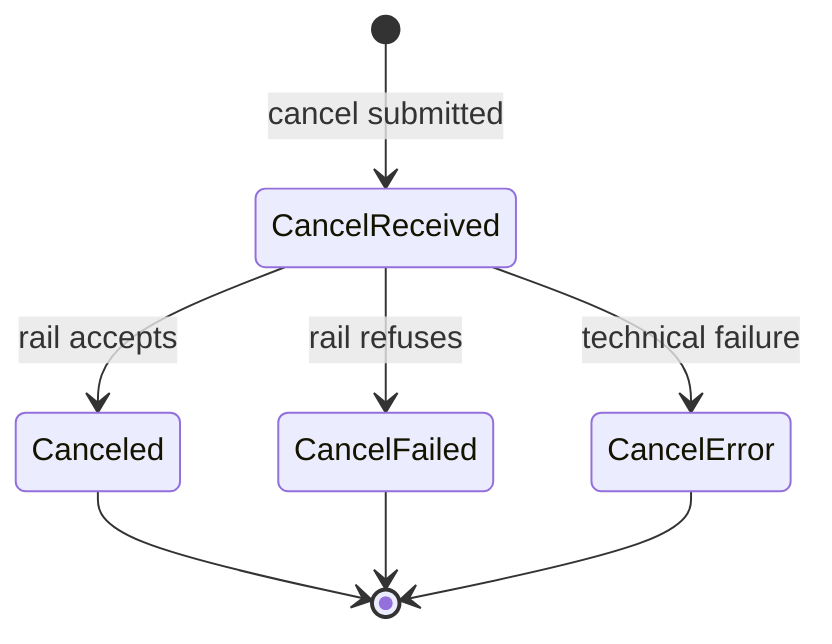

Cancel is the instruction that releases an **active authorization hold** before clearing has accepted the capture. It only makes sense in the **DMS** model. On **SMS** rails the money has already moved by the time authorization succeeds, so there is no hold to release; the equivalent business outcome is a **refund**.

Cancel **moves no money**. The hold dissolves at the rail and the shopper's available credit or balance is restored once the issuer processes the reversal.

### Partial Cancel

A **partial cancel** (partial reversal) releases part of an authorization hold while leaving the remainder live for later capture. Not every acquirer or PSP exposes it.

Multiple partial cancels can stack against the same authorization, each reducing the remaining authorized balance, until the balance reaches zero or the merchant captures what is left.

> **LPMs essentially never support partial cancel.** The few rails that expose any cancel usually expose only full-amount cancel.

### Cancel State Machine

Cancel is typically synchronous at the API surface. The acquirer accepts or refuses quickly because no clearing instruction is dispatched.

- **`CancelReceived`** — accepted and in flight toward the rail.
- **`Canceled`** — accepted by the rail.
- **`CancelFailed`** — refused by the rail.
- **`CancelError`** — technical failure prevented a clean outcome.

The parent authorization carries aggregate state separately. Each successful per-operation `Canceled` decrements remaining authorized balance; parent transitions `Authorised` -> `PartiallyCanceled` -> `Canceled`.

> **Cancel after capture submitted:** once capture has already been submitted, behavior depends on capture state and may require refund after clearing acceptance.

### The Five Lenses

- **Semantics** — release an active authorization hold before clearing has accepted capture; DMS-only; no money movement.
- **State model** — per-operation states (`CancelReceived`, `Canceled`, `CancelFailed`, `CancelError`) with partial/full distinction on parent authorization.
- **Recovery** — idempotent cancel reference; race with capture must fail deterministically; recover `CancelError` via status query.
- **Time discipline** — bounded by clearing cutoff and authorization expiry.
- **Observability** — synchronous response where supported, webhook where async, status query for authoritative state.
