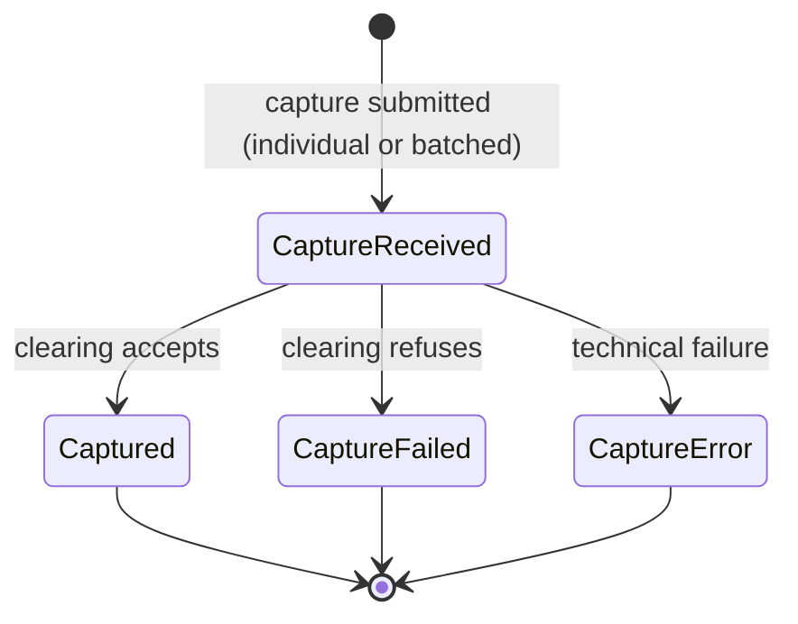

Capture is the instruction that turns an authorization into money the merchant will actually receive. It is **required on DMS rails** and effectively a **no-op on SMS**.

### Individual vs Batch Capture

- **Individual capture** — per-authorization capture call when fulfillment obligation is met.
- **Batch capture** — authorizations accumulated and submitted at acquirer clearing cutoff.

Many PSPs expose a hybrid: per-authorization API calls while aggregating into a batch at cutoff.

### Capture Variants

Capture supports amount variants beyond full one-shot capture:

- **Partial capture** — capture less than authorized amount.
- **Multiple captures** — several captures against same authorization up to authorized total.
- **Over-capture** — allowed only in constrained scheme/MCC contexts.
- **Force capture** — capture without matching live authorization (high-risk and restricted).

On SMS rails these variants are usually represented via separate transactions or refunds.

### Capture State Machine

Capture is **asynchronous on DMS rails**.

- **`CaptureReceived`** — accepted and in flight toward clearing.
- **`Captured`** — clearing accepted capture.
- **`CaptureFailed`** — clearing refused capture.
- **`CaptureError`** — technical failure prevented clean delivery.

### Cancel After Capture Is Submitted

When merchant tries to cancel after capture submission:

- **Capture in `CaptureReceived` (pre-cutoff)** — often can still be pulled from pending batch.
- **Capture in `Captured` (post-cutoff)** — clearing already accepted; cancel fails and merchant must refund.

If capture and cancel race, deterministic ordering on authorization id decides winner; integration must be idempotent on both operations.

### The Five Lenses

- **Semantics** — present prior authorization into clearing; capture decides what is owed.
- **State model** — one in-flight state plus three terminal outcomes (`Captured`, `CaptureFailed`, `CaptureError`).
- **Recovery** — idempotent capture reference; status query before replay after uncertain outcomes.
- **Time discipline** — capture window and clearing cutoff are controlling clocks.
- **Observability** — webhooks and status query per capture object; settlement report is final reconciliation source.
