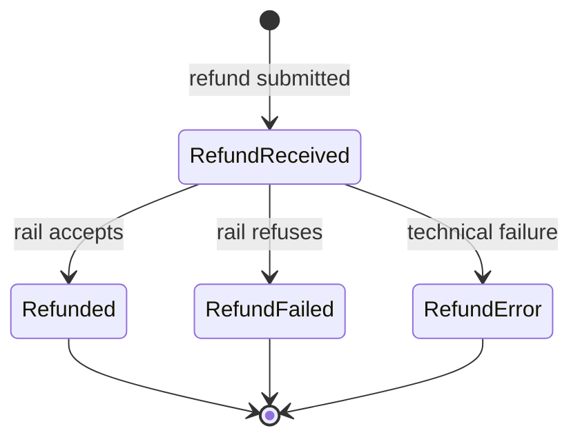

Refund returns money to the shopper after clearing has accepted capture, linked to the original payment. It is the universal undo primitive across cards and most LPMs (with method-specific exceptions such as some voucher/cash flows).

Unlike cancel, refund **moves money** and appears as a separate credit transaction to the shopper.

### Partial Refund

Partial refund is widely supported. Multiple partial refunds can stack against the same capture with cumulative sum capped at captured amount.

### Refund State Machine

Refund is often synchronous at API acceptance, while cardholder-visible posting remains asynchronous.

- **`RefundReceived`** — accepted and in flight toward rail settlement.
- **`Refunded`** — accepted by rail.
- **`RefundFailed`** — refused by rail.
- **`RefundError`** — technical failure prevented clean outcome.

The parent payment tracks aggregate refund status separately (`Captured` -> `PartiallyRefunded` -> `Refunded`).

### The Five Lenses

- **Semantics** — return money after clearing acceptance; full/partial/multiple refunds where supported.
- **State model** — one in-flight state and three terminal outcomes (`Refunded`, `RefundFailed`, `RefundError`), with partial/full tracked on parent.
- **Recovery** — idempotent refund reference and server-side cap enforcement for partial refunds.
- **Time discipline** — rail-specific refund window plus settlement lag to cardholder-visible posting.
- **Observability** — webhooks, status query, and reconciliation report lines per refund object.
