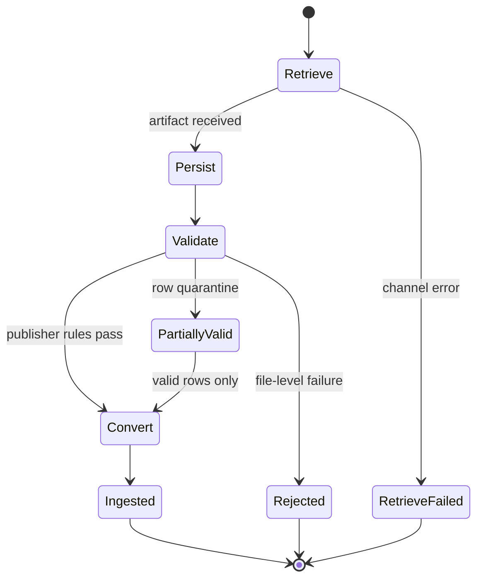

## Background

Every acquirer and PSP publishes settlement reports in its own shape: schemas, delivery channels, payout cadences, and adjustment conventions. A platform routing cards, wallets, and bank transfers must ingest every variant and join each file to internal payment records.

The **settlement report** (also called a reconciliation file, payout report, or funding statement, depending on the publisher) is the **source of truth** for money that moved. Payment records capture intent; the report shows what cleared, what was netted, and what reached the bank. Reconciliation needs both views joined reliably.

Engineering teams chronically under-invest in a dedicated settlement report processing **engine**. Finance depends on it, but roadmap priority goes to payment acceptance and new methods. Without a purpose-built replacement, teams extend a legacy ingest path through patches, manual operations, and one-off scripts. Each workaround defers proper design. The engine accumulates brittle mappings, tacit runbook steps, on-call pages when a file format drifts, and repeated manual transforms that introduce inconsistency. Publisher-specific quirks embed in core systems; acquirer-specific logic interleaves across shared paths, so every new onboarding carries regression risk.

Part 1 of this series designs that engine to close the gap.

## Challenges

A payment platform records authorizations, captures, refunds, and chargebacks as operational events. **Settlement** is when funds move: the acquirer or PSP nets fees, reserves, and adjustments, then pays the merchant on a payout cadence. The settlement report is the authoritative record of that movement.

For each settlement window and each merchant or MID, the platform must answer:

- Which internal transactions settled in this payout?
- What fees, reserves, and FX adjustments explain the delta between gross and net?
- Where settlement lines, existing records, and bank statement entries disagree, and what explains the exceptions?

Answering those questions at scale means clearing provider-specific obstacles in ingestion, matching, and operations.

**Heterogeneous report formats**

Each PSP and acquirer publishes its own schema: column names, date formats, amount signs, fee breakdowns, and identifier fields differ. Each payment method adds another variant. Reports arrive as CSV, fixed-width, XML, or JSON via API. A publisher may expose multiple report types—transaction-level detail, summary by day, payout-level totals—that tie together only through report id or payout reference.

**Delivery channels and scheduling**

Reports arrive over SFTP, email, HTTPS API, or provider portals. Delivery time and generation schedule vary by provider, MID, and report type. Some files land hours after the payout batch closes; others on T+1 or later; LPM schemes may skip a business day. Files go missing, arrive late, or arrive corrupt—each case blocking the reconciliation window finance needs.

**Report scope and organization**

Providers slice reports by master MID, sub-merchant MID, currency, or payout batch. The same merchant may receive separate files per currency or per legal entity. Correlating everything that belongs to one settlement window is non-trivial when the model is not one file per merchant per day.

**Credential and secret management**

SFTP keys, API tokens, and mailbox credentials multiply with every provider and merchant account. Legacy setups often embed them per integration, which makes rotation, access control, and environment isolation costly to change.

**Identifier alignment**

Internal systems key on orchestrator payment ids, PSP payment references, authorization codes, and network retrieval reference numbers. Reports may use any subset of those, or only provider-native ids. Overlap is incomplete, joins are ambiguous, and wrong attachments are easy to miss without explicit review.

**Versioning and amendments**

Providers rarely republish an identical file with an explicit version flag when something changes. More often, a later report for the same payout batch carries **adjustment journal lines** that correct or reverse entries from an earlier delivery. A settlement window that looked closed can gain new lines weeks later.

**File quality and partial failure**

Provider files contain malformed rows, unexpected enums, or amount fields that fail validation. Legacy pipelines often treat a file as all-or-nothing: one bad row fails the entire import and blocks reconciliation for every other line in the batch.

**Amount semantics**

Gross, net, fee, tax, and FX conversion lines use inconsistent signs and currencies across providers. Some rows carry transaction currency and settlement currency on different columns; others mix both on one amount. Fee breakdowns may appear as separate lines, embedded in net, or booked in a later report.

**Volume**

Large merchants generate millions of lines per file; volume multiplies when many providers and MIDs deliver on the same T+1 window. Pipelines sized for smaller files hit memory limits, run hours-long batch jobs, and fall behind finance close deadlines.

**Observability, monitoring, and audit**

When finance finds a mismatch, legacy pipelines often cannot trace it back to a specific file version, transformation rule, or payment id. Ingest lag, match rate, and exception volume stay invisible until someone notices a failed close or a bank deposit that does not tie out. Missing, delayed, or corrupt reports surface through manual checks rather than proactive detection. Raw provider files and normalized rows are discarded or scattered across ad hoc storage, so an audit months later cannot reconstruct what was processed or why.

## Goal

Part 1 designs the **settlement report processing engine** (**engine**) — the subsystem between **publishers** and **consumers** — to:

- Ingest, normalize, and reconcile settlement reports through one generic path across publishers.
- Standardize the reconciliation workflow so finance and engineering share the same exception model.
- Persist raw reports and normalized rows so history survives reprocessing and amendments.
- Expose queryable settlement data that joins reliably to payment records and bank statements.
- Make reconciliation repeatable, auditable, and automatable end-to-end.
- Onboard new publishers, report types, and file formats through configuration, not large system changes.
- Let consumers choose export format, column layout, grouping, and generation schedule without forking the engine.

**Part 1 scope:** This post designs ingest, the canonical settlement model, the ledger, and consumer access. Correlation, three-way matching, and finance close appear in the capability inventory below; detailed design for those stages is part 2.

## Capability inventory

High-level capabilities the **engine** must provide. Part 1 implements the design sections through the ledger and consumer surface; matching and close are specified here, designed in depth in part 2.

- **Multi-channel ingestion**: Accept reports over SFTP, email, API, and publisher portal; track expected delivery; alert on missing, late, or corrupt files.
- **Credential management**: Centralize publisher credentials with rotation and per-environment isolation.
- **Configuration-driven formats**: Map publisher layouts into the canonical model through declarative definitions.
- **Amount normalization**: Per-publisher signs, line categories, and currencies aligned to one engine convention.
- **Partial failure handling**: Quarantine invalid rows; continue valid rows in the same file.
- **Report scope and correlation**: Group files into settlement windows before matching runs.
- **Identifier matching**: Join through an external id map; route ambiguous matches to review.
- **Versioning and amendments**: Idempotent ingest; retain superseded artifacts; re-run downstream stages when adjustment lines arrive.
- **Three-way reconciliation**: Match settlement lines to payment records and bank movements; track exceptions by reason.
- **Persistence and query**: Retain raw and normalized data for the publisher retention window; query by merchant scope and window.
- **Consumer APIs and exports**: Query, reconciliation control, webhooks, and configurable batch output.
- **Volume at scale**: Stream or chunk large files; batch-scoped commits; idempotent replay.
- **Observability and audit**: Ingest lag, match rate, exception metrics, and lineage to source artifacts and mapping versions.
- **AI-assisted operations**: Operator tooling for ingest health, mapping review, and quarantine triage without ad hoc spreadsheets.
- **Settlement file simulation**: Publisher-shaped fixtures to regression-test ingest and reconciliation before production files arrive.

## System Design

Challenges uses *provider* and *PSP* in their everyday industry sense. Below, **publisher**, **engine**, and **consumer** name the pipeline roles.

The **settlement report processing engine** (**engine**) sits between publishers and consumers:

- **Publisher**: Upstream partner that delivers settlement or reconciliation artifacts — card PSP, acquirer, wallet operator, bank, or LPM partner.
- **Engine**: The standalone subsystem this post designs — ingest, normalization, ledger, reconciliation, and outbound APIs. It may run inside a wider payment platform but is not itself a platform others operate on.
- **Consumer**: Downstream reader of normalized settlement data — automated reconciliation and finance jobs, internal data pipelines, and human-facing surfaces (operations consoles, merchant dashboards, partner PSP exports).

```text
Publisher  →  Engine  →  Consumer
```

### Ingest pipeline

Ingest moves a settlement artifact from the **publisher** into the **engine** — durable storage and normalized rows. Four phases run in order; each phase commits independently so a later failure does not discard a successful retrieve or persist.

- **Retrieve**: Fetch new settlement artifacts from the publisher over the configured channel (API, SFTP, email, or portal). Track expected delivery by publisher, merchant account, report type, and settlement window; detect missing, late, duplicate, or corrupt delivery.
- **Persist**: Store the raw artifact immutably and register metadata for replay and audit before any parsing runs.
- **Validate**: Apply **publisher file rules** on file structure and **canonical rules** on business meaning (line types, amounts, currencies, identifiers). Quarantine or reject failures according to policy; let valid rows continue.
- **Convert**: Map publisher layout into the canonical settlement model (below). Drive mapping from configuration per publisher and report type so new formats rarely require engine code changes.



### Canonical settlement fields

The canonical model is the engine's contract with reconciliation, the ledger, and consumer APIs: one normalized shape every publisher maps into, not a fork per rail.

- **Identity**: Stable keys for each line and source report; scope to merchant, MID, legal entity, payout batch, and settlement window as the publisher defines them.
- **Payment linkage**: Identifiers sufficient to join a line to internal payment records and to publisher-native references, maintained through a shared external id map.
- **Line classification**: payment, refund, chargeback, fee, tax, reserve, FX adjustment, payout summary, and similar; publisher-specific labels map once at configuration time.
- **Amounts**: Gross, net, and fee components where the publisher supplies them; transaction and settlement currency when both exist; one sign convention for the engine, transformed per publisher on ingest.
- **Timing**: Transaction, clearing, settlement, and payout timestamps as the publisher provides them; optional fields stay explicit, not overloaded into a single column.
- **Lineage**: Trace from any normalized row back to source artifact, mapping version, ingest run, and quarantine outcome when a row did not pass validation.

New publishers add mapping configuration from their report layout to this model; they do not fork the schema.

### Correlation and reconciliation

After ingest, the engine assembles ledger lines into settlement windows and runs matching before consumers treat a window as closed. Part 2 expands this stage; part 1 states the design boundaries.

- **Correlation**: Group normalized lines and source files by merchant scope, currency, legal entity, payout batch, and settlement window. Allow multiple files per window; complete or explicitly waive the batch before matching starts.
- **Matching**: Join ledger lines to internal payment records through the external id map; send ambiguous pairs to review instead of silent attachment.
- **Three-way reconciliation**: Compare matched settlement totals to bank movements; classify residuals with a stable reason taxonomy; use match rate and exception volume to drive finance close.

### Settlement ledger

The ledger is the append-only store of normalized settlement facts after ingest. It is not the payment authorization ledger and not the merchant’s bank statement; it is the **engine’s** durable view of what **publishers** reported as settled.

- **Writes**: Append lines as ingest completes; treat amendments as new facts that reference prior lines rather than silent overwrites. Preserve history when a publisher corrects or reverses an earlier report.
- **Reads**: Serve reconciliation by settlement window and merchant scope; serve finance with gross-to-net views by line category; serve audit with a path from any balance or exception back to raw artifacts and mapping versions.
- **Immutability**: Do not rewrite closed totals or matched outcomes in place. Replays and late amendments add new facts and supersession links so finance can answer what the engine knew on close day.

### Consumer APIs and webhooks

The **engine** exposes normalized settlement data to **consumers** — automated reconciliation and finance jobs, internal data pipelines, and human-facing surfaces (operations consoles, merchant dashboards, partner PSP exports) — not back to the **publisher** unless you operate a separate partner export product.

- **Query API**: Read settlement lines and payout batches by window, merchant scope, currency, and match status, with enough lineage for support and audit.
- **Reconciliation API**: Start or monitor three-way match for a window; surface exceptions with a stable reason taxonomy; record manual resolutions with actor and time.
- **Webhooks**: Push lifecycle signals when ingest finishes, when a window has the files reconciliation needs (or an explicit waiver), and when reconciliation reaches a close outcome — summaries only, not full file payloads.
- **Configurable export**: Offer scheduled or on-demand batch extracts for consumers that prefer files over APIs, using the same canonical model as the ledger.

### Operations

Supporting capabilities from the inventory that cut across ingest and reconciliation:

- **Observability and audit**: Surface ingest lag, match rate, and exception counts; trace any published total back to source artifacts and mapping versions.
- **AI-assisted operations**: Give operators structured access to ingest health, mapping definitions, and quarantine queues so format drift and spikes do not depend on ad hoc SQL.
- **Settlement file simulation**: Generate publisher-shaped fixtures to regression-test retrieve through reconciliation before production files arrive.

