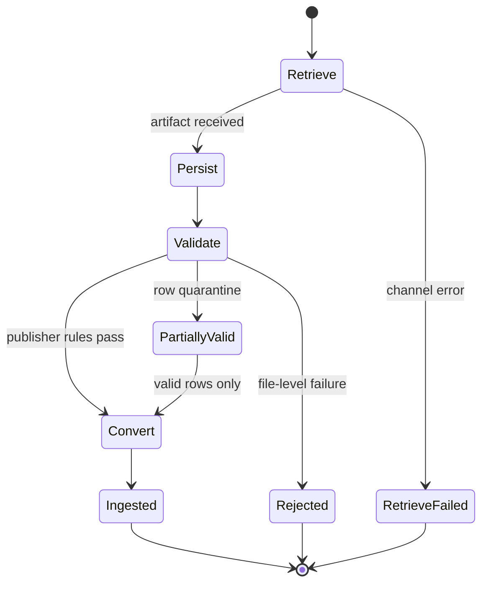

## System Design

**Publisher**, **engine**, and **consumer** name the pipeline roles below. *PSP* and *acquirer* stay in their everyday industry sense where entity type matters.

The **settlement report processing engine** (**engine**) sits between publishers and consumers:

- **Publisher**: Upstream partner that delivers settlement or reconciliation artifacts — card PSP, acquirer, wallet operator, bank, or LPM partner.
- **Engine**: The standalone subsystem this post designs — ingest, normalization, ledger, reconciliation, and outbound APIs. It may run inside a wider payment platform but is not itself a platform others operate on.
- **Consumer**: Downstream reader of normalized settlement data — automated reconciliation and finance jobs, internal data pipelines, and human-facing surfaces (operations consoles, merchant dashboards, partner PSP exports).

```text
Publisher  →  Engine  →  Consumer
```

### Ingest pipeline

Ingest moves a settlement artifact from the **publisher** into the **engine** — durable storage and normalized rows. Four phases run in order; each phase commits independently so a later failure does not discard a successful retrieve or persist.

- **Retrieve**: Fetch new settlement artifacts from the publisher over the configured channel (API, SFTP, email, or portal). Track expected delivery by publisher, merchant account, report type, and settlement window; detect missing, late, duplicate, or corrupt delivery.
- **Persist**: Store the raw artifact immutably and register metadata for replay and audit before any parsing runs.
- **Validate**: Apply **publisher file rules** on file structure and **canonical rules** on business meaning (line types, amounts, currencies, identifiers). Quarantine or reject failures according to policy; let valid rows continue.
- **Convert**: Map publisher layout into the canonical settlement model (below). Drive mapping from configuration per publisher and report type so new formats rarely require engine code changes.



### Canonical settlement fields

The canonical model is the engine's contract with reconciliation, the ledger, and consumer APIs: one normalized shape every publisher maps into, not a fork per rail.

- **Identity**: Stable keys for each line and source report; scope to merchant, MID, legal entity, payout batch, and settlement window as the publisher defines them.
- **Payment linkage**: Identifiers sufficient to join a line to internal payment records and to publisher-native references, maintained through a shared external id map.
- **Line classification**: payment, refund, chargeback, fee, tax, reserve, FX adjustment, payout summary, and similar; publisher-specific labels map once at configuration time.
- **Amounts**: Gross, net, and fee components where the publisher supplies them; transaction and settlement currency when both exist; one sign convention for the engine, transformed per publisher on ingest.
- **Timing**: Transaction, clearing, settlement, and payout timestamps as the publisher provides them; optional fields stay explicit, not overloaded into a single column.
- **Lineage**: Trace from any normalized row back to source artifact, mapping version, ingest run, and quarantine outcome when a row did not pass validation.

New publishers add mapping configuration from their report layout to this model; they do not fork the schema.

### Correlation and reconciliation

After ingest, the engine assembles ledger lines into settlement windows and runs matching before consumers treat a window as closed.

- **Correlation**: Group normalized lines and source files by merchant scope, currency, legal entity, payout batch, and settlement window. Allow multiple files per window; complete or explicitly waive the batch before matching starts.
- **Matching**: Join ledger lines to internal payment records through the external id map; send ambiguous pairs to review instead of silent attachment.
- **Three-way reconciliation**: Compare matched settlement totals to bank movements; classify residuals with a stable reason taxonomy; use match rate and exception volume to drive finance close.

### Settlement ledger

The ledger is the append-only store of normalized settlement facts after ingest. It is not the payment authorization ledger and not the merchant’s bank statement; it is the **engine’s** durable view of what **publishers** reported as settled.

- **Writes**: Append lines as ingest completes; treat amendments as new facts that reference prior lines rather than silent overwrites. Preserve history when a publisher corrects or reverses an earlier report.
- **Reads**: Serve reconciliation by settlement window and merchant scope; serve finance with gross-to-net views by line category; serve audit with a path from any balance or exception back to raw artifacts and mapping versions.
- **Immutability**: Do not rewrite closed totals or matched outcomes in place. Replays and late amendments add new facts and supersession links so finance can answer what the engine knew on close day.

### Consumer APIs and webhooks

The **engine** exposes normalized settlement data to **consumers** — automated reconciliation and finance jobs, internal data pipelines, and human-facing surfaces (operations consoles, merchant dashboards, partner PSP exports) — not back to the **publisher** unless you operate a separate partner export product.

- **Query API**: Read settlement lines and payout batches by window, merchant scope, currency, and match status, with enough lineage for support and audit.
- **Reconciliation API**: Start or monitor three-way match for a window; surface exceptions with a stable reason taxonomy; record manual resolutions with actor and time.
- **Webhooks**: Push lifecycle signals when ingest finishes, when a window has the files reconciliation needs (or an explicit waiver), and when reconciliation reaches a close outcome — summaries only, not full file payloads.
- **Configurable export**: Offer scheduled or on-demand batch extracts for consumers that prefer files over APIs, using the same canonical model as the ledger.

### Operations

Supporting capabilities from the inventory that cut across ingest and reconciliation:

- **Observability and audit**: Surface ingest lag, match rate, and exception counts; trace any published total back to source artifacts and mapping versions.
- **AI-assisted operations**: Give operators structured access to ingest health, mapping definitions, and quarantine queues so format drift and spikes do not depend on ad hoc SQL.
- **Settlement file simulation**: Generate publisher-shaped fixtures to regression-test retrieve through reconciliation before production files arrive.
